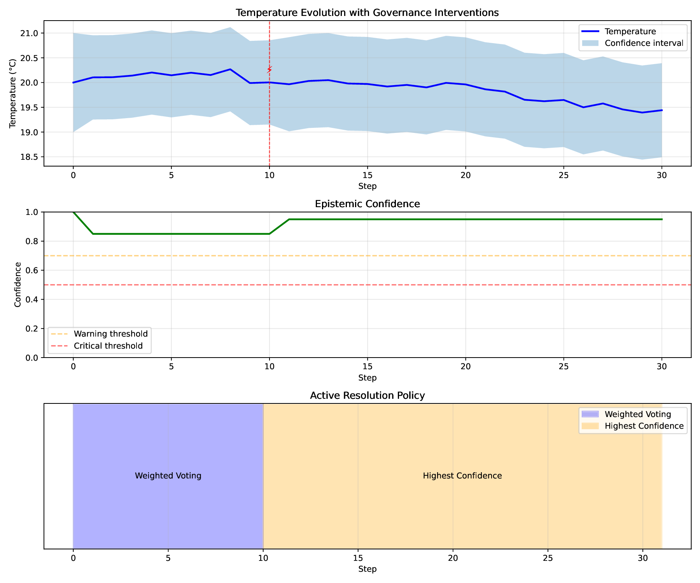

# Basic Governance

- **Level:** 🟢 Beginner
- **Est. Time:** 15 minutes
- **Concepts:** SystemInvariant, Invariant Phases, Policy Switching, Epistemic Monitoring


This example provides:

- Complete governance implementation from scratch
- Multiple governance units (action + monitoring)
- Scientific method pattern explanation
- Detailed analysis of governance effectiveness
- Visualization with governance annotations
- Clear expected output
- Exercises for further exploration


---

## Overview

This example builds on the [Simple Growth Model](./simple-growth.md) by adding **governance** - the ability for the simulation to monitor its own health and adapt dynamically.

We'll create governance that:

- **Monitors** the disagreement between competing mechanisms
- **Detects** when predictions become too fragmented
- **Responds** by switching to a more stable resolution policy
- **Logs** all governance actions for auditability

```python
from typing import Any

import matplotlib.patches as mpatches
import matplotlib.pyplot as plt
import numpy as np

from procela import (
    Executive,
    HighestConfidencePolicy,
    InvariantPhase,
    InvariantViolation,
    KeyAuthority,
    Mechanism,
    RangeDomain,
    SystemInvariant,
    Variable,
    VariableRecord,
    VariableSnapshot,
    WeightedConfidencePolicy,
)

rng = np.random.default_rng(1)
INITIAL_SOURCE = KeyAuthority.issue(None)
```

---

## Step 1: Create a More Challenging Scenario

First, let's create a variable with three competing mechanisms that have **divergent views**:

```python
# Temperature variable with realistic range
temperature = Variable(
    name="Temperature",
    domain=RangeDomain(-10, 45),
    policy=WeightedConfidencePolicy(),  # Start with weighted voting
)

temperature.init(VariableRecord(20.0, confidence=1.0, source=INITIAL_SOURCE))


class WarmingMechanism(Mechanism):
    """Predict warming trend (climate change perspective)."""

    def __init__(self) -> None:
        """Warming mechanism constructor."""
        super().__init__(reads=[temperature], writes=[temperature])
        self.drift = 0.15

    def transform(self) -> None:
        """Transform method."""
        current = self.reads()[0].value
        # Strong warming bias
        new_temp = current + self.drift + rng.normal(0, 0.2)

        # High confidence in warming
        confidence = 0.85

        self.writes()[0].add_hypothesis(
            VariableRecord(
                value=new_temp,
                confidence=confidence,
                source=self.key(),
                metadata={"drift": self.drift},
            )
        )
        print(f"  🔥 Warming model: {new_temp:.1f}°C (conf: {confidence:.2f})")


class CoolingMechanism(Mechanism):
    """Predicts cooling trend (counter-perspective)."""

    def __init__(self) -> None:
        """Cooling mechanism constructor."""
        super().__init__(reads=[temperature], writes=[temperature])
        self.drift = -0.1

    def transform(self) -> None:
        """Transform method."""
        current = self.reads()[0].value
        # Cooling bias
        new_temp = current + self.drift + rng.normal(0, 0.2)

        # Moderate confidence
        confidence = 0.75

        self.writes()[0].add_hypothesis(
            VariableRecord(
                value=new_temp,
                confidence=confidence,
                source=self.key(),
                metadata={"drift": self.drift},
            )
        )
        print(f"  ❄️ Cooling model : {new_temp:.1f}°C (conf: {confidence:.2f})")


class StableMechanism(Mechanism):
    """Predict stability (conservative view)."""

    def __init__(self) -> None:
        """Stable mechanism constructor."""
        super().__init__(reads=[temperature], writes=[temperature])

    def transform(self) -> None:
        """Transform method."""
        current = self.reads()[0].value
        # Minimal change
        new_temp = current + rng.normal(0, 0.1)

        # Very high confidence in stability
        confidence = 0.95

        self.writes()[0].add_hypothesis(
            VariableRecord(
                value=new_temp,
                confidence=confidence,
                source=self.key(),
                metadata={"type": "conservative"},
            )
        )
        print(f"  🌡️ Stable model  : {new_temp:.1f}°C (conf: {confidence:.2f})")
```

---

## Step 2: Create a Governance Invariant

Now let's create a governance unit that monitors hypothesis **fragility** (disagreement):

```python
class FragilityGovernance(SystemInvariant):
    """
    Monitor hypothesis disagreement and switches policy when conflicts arise.

    This governance unit follows the scientific method pattern:
    DETECT → HYPOTHESIZE → EXPERIMENT → EVALUATE → CONCLUDE
    """

    def __init__(
        self,
        executive: Executive,
        variable: Variable,
        disagreement_threshold: float = 0.8,
    ) -> None:
        """Fragility governance constructor."""
        self.executive = executive
        self.variable = variable
        self.disagreement_threshold = disagreement_threshold
        self.policy_switched = False
        self.violation_count = 0
        self.action_log: list[dict[str, Any]] = []

        def check(snapshot: VariableSnapshot) -> bool:
            """
            DETECT phase: Check if mechanisms disagree too much.

            Returns
            -------
                True if system is healthy, False if governance action needed
            """
            # Get all proposed values for current step
            hypotheses = variable.hypotheses

            if len(hypotheses) < 2:
                return True  # Not enough data to judge

            # Calculate disagreement (range of predictions)
            values = [h.record.value for h in hypotheses if h.record is not None]
            min_val = min(values)
            max_val = max(values)
            disagreement = max_val - min_val

            # Track for analysis
            self.current_disagreement = disagreement

            # Log if disagreement is high
            if disagreement > self.disagreement_threshold:
                print(
                    f"\n  ⚠️  High disagreement detected: {disagreement:.1f}°C spread"
                )
                return False  # Violation - need governance action
            else:
                return True  # System is healthy

        def handle(invariant: InvariantViolation, snapshot: VariableSnapshot) -> None:
            """
            RESPOND phase: Take action to resolve the violation.

            This follows the scientific method:
            - HYPOTHESIZE: Switching policy will stabilize the system
            - EXPERIMENT: Actually switch the policy
            - EVALUATE: Monitor if violation resolves
            - CONCLUDE: Keep or revert (we keep if it helps)
            """
            self.violation_count += 1

            # Log the action
            action = {
                "step": snapshot.step,
                "disagreement": self.current_disagreement,
                "action": "switch_policy",
                "old_policy": type(self.variable.policy).__name__,
            }

            if not self.policy_switched:
                print("\n  🎯 GOVERNANCE ACTION: Switching to HighestConfidencePolicy")
                print(
                    f"     (Disagreement: {self.current_disagreement:.1f}°C > "
                    f"{self.disagreement_threshold}°C)"
                )

                # HYPOTHESIS: Highest confidence policy will be more stable
                self.variable.policy = HighestConfidencePolicy()
                self.policy_switched = True
                action["new_policy"] = self.variable.policy.name
            else:
                print("\n  🔄 GOVERNANCE ACTION: Maintaining HighestConfidencePolicy")
                action["new_policy"] = "HighestConfidencePolicy (already active)"

            self.executive.logger.info(action)
            self.action_log.append(action)

        super().__init__(
            name="FragilityGovernance",
            condition=check,
            on_violation=handle,
            phase=InvariantPhase.RUNTIME,  # Check during execution
            message="Hypothesis disagreement exceeded threshold",
        )
```

---

## Step 3: Create a Monitoring Invariant

Let's add a second governance unit that just monitors (doesn't act):

```python
class CoverageMonitor(SystemInvariant):
    """
    Monitor prediction accuracy but doesn't take action.

    Useful for logging and analysis.
    """

    def __init__(self, window_size: float = 10) -> None:
        """Coverage monitor constructor."""
        self.window_size = window_size
        self.predictions: list[float] = []
        self.errors: list[float] = []

        def domain_range(var: Variable) -> float:
            domain = var.domain
            if (
                not isinstance(domain, RangeDomain)
                or domain.max_value is None
                or domain.min_value is None
            ):
                return 1.0
            return domain.max_value - domain.min_value

        def check(snapshot: VariableSnapshot) -> bool:
            """
            Calculate prediction coverage (accuracy).

            Always returns True (monitoring only, no action).
            """
            var = KeyAuthority.resolve(snapshot.views[0].key)
            if not isinstance(var, Variable):
                return True

            if var.memory is None or var.stats.count < 2:
                return True

            # Get last prediction and actual
            last_actual = var.value
            last_records = var.get(-1)[0]
            if not last_records or last_records[1] is None:
                return True
            last_prediction = last_records[1].value

            # Calculate error
            error = abs(last_actual - last_prediction)
            self.errors.append(error)
            self.predictions.append(last_prediction)

            # Keep window
            if len(self.errors) > self.window_size:
                self.errors.pop(0)
                self.predictions.pop(0)

            # Calculate rolling coverage
            if len(self.errors) >= self.window_size:
                avg_error = np.mean(self.errors)
                max_possible_error = domain_range(var)
                coverage = 1 - (avg_error / max_possible_error)

                # Log coverage level
                if coverage < 0.5:
                    print(f"  📊 Coverage warning: {coverage:.2f} (low accuracy)")
                elif coverage > 0.8:
                    print(f"  📊 Coverage good: {coverage:.2f}")

            return True  # Monitoring only, no violation

        super().__init__(
            name="CoverageMonitor",
            condition=check,
            on_violation=None,  # No action
            phase=InvariantPhase.POST,  # Check after resolution
            message="Monitoring prediction coverage",
        )
```

---

## Step 4: Run Simulation with Governance

```python
# Create mechanisms
mechanisms = [WarmingMechanism(), CoolingMechanism(), StableMechanism()]

# Create executive
executive = Executive(mechanisms=mechanisms)
executive.set_rng(rng=rng)

# Add governance units
fragility_gov = FragilityGovernance(
    executive, variable=temperature, disagreement_threshold=0.8
)
coverage_monitor = CoverageMonitor(window_size=10)

executive.add_invariant(fragility_gov)
executive.add_invariant(coverage_monitor)

print("\n" + "=" * 60)
print("Temperature Simulation with Governance")
print("=" * 60)
print("\n📋 Governance Rules:")
print("   - Monitor hypothesis disagreement")
print("   - If disagreement > 2.0°C, switch to HighestConfidencePolicy")
print("   - Track prediction coverage (accuracy)")
print("\n" + "-" * 60 + "\n")


# Run simulation
executive.run(steps=30)

print("\n" + "=" * 60)
print("Simulation Complete!")
print(f"Final temperature: {temperature.value:.1f}°C")
print("=" * 60)
```

---

## Step 5: Analyze Governance Effectiveness

```python
def analyze_governance(temperature: Variable, governance: FragilityGovernance) -> None:
    """Analyze how governance affected the simulation."""
    if temperature.memory is None:
        return

    print("\n📊 Governance Impact Analysis")
    print("-" * 40)

    # 1. Policy changes
    print("\n🔧 Policy Changes:")
    print(f"   Total violations detected: {governance.violation_count}")
    print(f"   Policy switched: {governance.policy_switched}")

    if governance.action_log:
        print("\n📝 Governance Action Log:")
        for action in governance.action_log[:5]:  # Show first 5 actions
            print(f"   Step {action['step']}: {action['action']}")
            print(f"      Disagreement: {action['disagreement']:.1f}°C")
            print(f"      Policy: {action['old_policy']} → {action['new_policy']}")

    # 2. Confidence analysis
    confidences = [
        r.confidence for _, r, _ in temperature.memory.records() if r is not None
    ]
    print("\n💪 Confidence Statistics:")
    print(f"   Mean confidence: {np.mean(confidences):.3f}")
    print(f"   Std deviation:  {np.std(confidences):.3f}")
    print(f"   Min confidence:  {np.min(confidences):.3f}")
    print(f"   Max confidence:  {np.max(confidences):.3f}")

    # 3. Stability before/after governance
    if governance.policy_switched:
        # Find when policy switched
        switch_step = governance.action_log[0]["step"]

        # Calculate volatility before and after
        values = [r.value for _, r, _ in temperature.memory.records() if r is not None]

        before_switch = values[:switch_step]
        after_switch = values[switch_step:]

        if len(before_switch) > 1 and len(after_switch) > 1:
            volatility_before = np.std(np.diff(before_switch))
            volatility_after = np.std(np.diff(after_switch))

            print("\n📈 Volatility Analysis:")
            print(f"   Before governance: {volatility_before:.3f}°C/step")
            print(f"   After governance:  {volatility_after:.3f}°C/step")

            if volatility_after < volatility_before:
                reduction = (1 - volatility_after / volatility_before) * 100
                print(f"   ✅ Volatility reduced by {reduction:.1f}%")
            else:
                print(
                    "   ⚠️  Volatility increased by "
                    f"{(volatility_after/volatility_before-1)*100:.1f}%"
                )

    # 4. Model influence
    sources = [
        KeyAuthority.resolve(r.source).__class__.__name__
        for _, r, _ in temperature.memory.records()
        if r is not None
        and r.source is not None
        and KeyAuthority.resolve(r.source) is not None
    ]
    if sources:
        from collections import Counter

        source_counts = Counter(sources)
        print("\n🎯 Model Influence (accepted hypotheses):")
        for source, count in source_counts.most_common():
            percentage = count / len(sources) * 100
            print(f"   {source}: {count} ({percentage:.1f}%)")


# Run analysis
analyze_governance(temperature, fragility_gov)
```

---

## Step 6: Visualization with Governance Annotations

```python
def plot_with_governance(
    temperature: Variable, governance: FragilityGovernance
) -> None:
    """Plot simulation with governance actions highlighted."""
    memory = temperature.memory
    if memory is None:
        return

    values = [r.value for _, r, _ in memory.records() if r is not None]
    confidences = [r.confidence for _, r, _ in memory.records() if r is not None]
    steps = list(range(len(values)))

    _, (ax1, ax2, ax3) = plt.subplots(3, 1, figsize=(12, 10))

    # Plot 1: Temperature with governance markers
    ax1.plot(steps, values, "b-", linewidth=2, label="Temperature")
    ax1.fill_between(
        steps,
        [v - c for v, c in zip(values, confidences)],
        [v + c for v, c in zip(values, confidences)],
        alpha=0.3,
        label="Confidence interval",
    )

    # Highlight governance actions
    for action in governance.action_log:
        step = action["step"]
        if step < len(steps):
            ax1.axvline(x=step, color="red", linestyle="--", alpha=0.7, linewidth=1)
            ax1.text(
                step,
                ax1.get_ylim()[1] * 0.95,
                "⚡",
                fontsize=12,
                ha="center",
                color="red",
            )

    ax1.set_xlabel("Step")
    ax1.set_ylabel("Temperature (°C)")
    ax1.set_title("Temperature Evolution with Governance Interventions")
    ax1.legend()
    ax1.grid(True, alpha=0.3)

    # Plot 2: Confidence over time
    ax2.plot(steps, confidences, "g-", linewidth=2)
    ax2.axhline(
        y=0.7, color="orange", linestyle="--", alpha=0.5, label="Warning threshold"
    )
    ax2.axhline(
        y=0.5, color="red", linestyle="--", alpha=0.5, label="Critical threshold"
    )
    ax2.set_xlabel("Step")
    ax2.set_ylabel("Confidence")
    ax2.set_title("Epistemic Confidence")
    ax2.set_ylim([0, 1])
    ax2.legend()
    ax2.grid(True, alpha=0.3)

    # Plot 3: Policy over time
    current_policy = "WeightedVoting"
    policy_changes = [(0, current_policy)]

    for action in governance.action_log:
        if action["action"] == "switch_policy":
            current_policy = action["new_policy"]
            policy_changes.append((action["step"], current_policy))

    # Create policy timeline
    for i in range(len(policy_changes)):
        start_step = policy_changes[i][0]
        end_step = (
            policy_changes[i + 1][0] if i + 1 < len(policy_changes) else len(steps)
        )
        policy_name = policy_changes[i][1]

        # Simplify policy name for display
        if "HighestConfidence" in policy_name:
            display_name = "Highest Confidence"
        else:
            display_name = "Weighted Voting"

        ax3.axvspan(
            start_step,
            end_step,
            alpha=0.3,
            color="orange" if "Highest" in policy_name else "blue",
        )
        ax3.text(
            (start_step + end_step) / 2,
            0.5,
            display_name,
            ha="center",
            va="center",
            fontsize=10,
        )

    ax3.set_xlabel("Step")
    ax3.set_yticks([])
    ax3.set_ylim([0, 1])
    ax3.set_title("Active Resolution Policy")
    ax3.grid(True, alpha=0.3)

    # Create legend for policy colors
    blue_patch = mpatches.Patch(color="blue", alpha=0.3, label="Weighted Voting")
    orange_patch = mpatches.Patch(color="orange", alpha=0.3, label="Highest Confidence")
    ax3.legend(handles=[blue_patch, orange_patch], loc="upper right")

    plt.tight_layout()
    plt.savefig("governance_simulation.pdf", dpi=150)
    plt.show()


# Uncomment to visualize
#plot_with_governance(temperature, fragility_gov)
```

---

## Complete Script

Here's the complete, runnable example:

```python
#!/usr/bin/env python3
"""Basic Governance - Monitoring and adapting to hypothesis disagreement"""

from typing import Any

import matplotlib.patches as mpatches
import matplotlib.pyplot as plt
import numpy as np

from procela import (
    Executive,
    HighestConfidencePolicy,
    InvariantPhase,
    InvariantViolation,
    KeyAuthority,
    Mechanism,
    RangeDomain,
    SystemInvariant,
    Variable,
    VariableRecord,
    VariableSnapshot,
    WeightedConfidencePolicy,
)

rng = np.random.default_rng(1)
INITIAL_SOURCE = KeyAuthority.issue(None)

# Temperature variable with realistic range
temperature = Variable(
    name="Temperature",
    domain=RangeDomain(-10, 45),
    policy=WeightedConfidencePolicy(),  # Start with weighted voting
)

temperature.init(VariableRecord(20.0, confidence=1.0, source=INITIAL_SOURCE))


class WarmingMechanism(Mechanism):
    """Predict warming trend (climate change perspective)."""

    def __init__(self) -> None:
        """Warming mechanism constructor."""
        super().__init__(reads=[temperature], writes=[temperature])
        self.drift = 0.15

    def transform(self) -> None:
        """Transform method."""
        current = self.reads()[0].value
        # Strong warming bias
        new_temp = current + self.drift + rng.normal(0, 0.2)

        # High confidence in warming
        confidence = 0.85

        self.writes()[0].add_hypothesis(
            VariableRecord(
                value=new_temp,
                confidence=confidence,
                source=self.key(),
                metadata={"drift": self.drift},
            )
        )
        print(f"  🔥 Warming model: {new_temp:.1f}°C (conf: {confidence:.2f})")


class CoolingMechanism(Mechanism):
    """Predicts cooling trend (counter-perspective)."""

    def __init__(self) -> None:
        """Cooling mechanism constructor."""
        super().__init__(reads=[temperature], writes=[temperature])
        self.drift = -0.1

    def transform(self) -> None:
        """Transform method."""
        current = self.reads()[0].value
        # Cooling bias
        new_temp = current + self.drift + rng.normal(0, 0.2)

        # Moderate confidence
        confidence = 0.75

        self.writes()[0].add_hypothesis(
            VariableRecord(
                value=new_temp,
                confidence=confidence,
                source=self.key(),
                metadata={"drift": self.drift},
            )
        )
        print(f"  ❄️ Cooling model : {new_temp:.1f}°C (conf: {confidence:.2f})")


class StableMechanism(Mechanism):
    """Predict stability (conservative view)."""

    def __init__(self) -> None:
        """Stable mechanism constructor."""
        super().__init__(reads=[temperature], writes=[temperature])

    def transform(self) -> None:
        """Transform method."""
        current = self.reads()[0].value
        # Minimal change
        new_temp = current + rng.normal(0, 0.1)

        # Very high confidence in stability
        confidence = 0.95

        self.writes()[0].add_hypothesis(
            VariableRecord(
                value=new_temp,
                confidence=confidence,
                source=self.key(),
                metadata={"type": "conservative"},
            )
        )
        print(f"  🌡️ Stable model  : {new_temp:.1f}°C (conf: {confidence:.2f})")


class FragilityGovernance(SystemInvariant):
    """
    Monitor hypothesis disagreement and switches policy when conflicts arise.

    This governance unit follows the scientific method pattern:
    DETECT → HYPOTHESIZE → EXPERIMENT → EVALUATE → CONCLUDE
    """

    def __init__(
        self,
        executive: Executive,
        variable: Variable,
        disagreement_threshold: float = 0.8,
    ) -> None:
        """Fragility governance constructor."""
        self.executive = executive
        self.variable = variable
        self.disagreement_threshold = disagreement_threshold
        self.policy_switched = False
        self.violation_count = 0
        self.action_log: list[dict[str, Any]] = []

        def check(snapshot: VariableSnapshot) -> bool:
            """
            DETECT phase: Check if mechanisms disagree too much.

            Returns
            -------
                True if system is healthy, False if governance action needed
            """
            # Get all proposed values for current step
            hypotheses = variable.hypotheses

            if len(hypotheses) < 2:
                return True  # Not enough data to judge

            # Calculate disagreement (range of predictions)
            values = [h.record.value for h in hypotheses if h.record is not None]
            min_val = min(values)
            max_val = max(values)
            disagreement = max_val - min_val

            # Track for analysis
            self.current_disagreement = disagreement

            # Log if disagreement is high
            if disagreement > self.disagreement_threshold:
                print(
                    f"\n  ⚠️  High disagreement detected: {disagreement:.1f}°C spread"
                )
                return False  # Violation - need governance action
            else:
                return True  # System is healthy

        def handle(invariant: InvariantViolation, snapshot: VariableSnapshot) -> None:
            """
            RESPOND phase: Take action to resolve the violation.

            This follows the scientific method:
            - HYPOTHESIZE: Switching policy will stabilize the system
            - EXPERIMENT: Actually switch the policy
            - EVALUATE: Monitor if violation resolves
            - CONCLUDE: Keep or revert (we keep if it helps)
            """
            self.violation_count += 1

            # Log the action
            action = {
                "step": snapshot.step,
                "disagreement": self.current_disagreement,
                "action": "switch_policy",
                "old_policy": type(self.variable.policy).__name__,
            }

            if not self.policy_switched:
                print("\n  🎯 GOVERNANCE ACTION: Switching to HighestConfidencePolicy")
                print(
                    f"     (Disagreement: {self.current_disagreement:.1f}°C > "
                    f"{self.disagreement_threshold}°C)"
                )

                # HYPOTHESIS: Highest confidence policy will be more stable
                self.variable.policy = HighestConfidencePolicy()
                self.policy_switched = True
                action["new_policy"] = self.variable.policy.name
            else:
                print("\n  🔄 GOVERNANCE ACTION: Maintaining HighestConfidencePolicy")
                action["new_policy"] = "HighestConfidencePolicy (already active)"

            self.executive.logger.info(action)
            self.action_log.append(action)

        super().__init__(
            name="FragilityGovernance",
            condition=check,
            on_violation=handle,
            phase=InvariantPhase.RUNTIME,  # Check during execution
            message="Hypothesis disagreement exceeded threshold",
        )


class CoverageMonitor(SystemInvariant):
    """
    Monitor prediction accuracy but doesn't take action.

    Useful for logging and analysis.
    """

    def __init__(self, window_size: float = 10) -> None:
        """Coverage monitor constructor."""
        self.window_size = window_size
        self.predictions: list[float] = []
        self.errors: list[float] = []

        def domain_range(var: Variable) -> float:
            domain = var.domain
            if (
                not isinstance(domain, RangeDomain)
                or domain.max_value is None
                or domain.min_value is None
            ):
                return 1.0
            return domain.max_value - domain.min_value

        def check(snapshot: VariableSnapshot) -> bool:
            """
            Calculate prediction coverage (accuracy).

            Always returns True (monitoring only, no action).
            """
            var = KeyAuthority.resolve(snapshot.views[0].key)
            if not isinstance(var, Variable):
                return True

            if var.memory is None or var.stats.count < 2:
                return True

            # Get last prediction and actual
            last_actual = var.value
            last_records = var.get(-1)[0]
            if not last_records or last_records[1] is None:
                return True
            last_prediction = last_records[1].value

            # Calculate error
            error = abs(last_actual - last_prediction)
            self.errors.append(error)
            self.predictions.append(last_prediction)

            # Keep window
            if len(self.errors) > self.window_size:
                self.errors.pop(0)
                self.predictions.pop(0)

            # Calculate rolling coverage
            if len(self.errors) >= self.window_size:
                avg_error = np.mean(self.errors)
                max_possible_error = domain_range(var)
                coverage = 1 - (avg_error / max_possible_error)

                # Log coverage level
                if coverage < 0.5:
                    print(f"  📊 Coverage warning: {coverage:.2f} (low accuracy)")
                elif coverage > 0.8:
                    print(f"  📊 Coverage good: {coverage:.2f}")

            return True  # Monitoring only, no violation

        super().__init__(
            name="CoverageMonitor",
            condition=check,
            on_violation=None,  # No action
            phase=InvariantPhase.POST,  # Check after resolution
            message="Monitoring prediction coverage",
        )


# Create mechanisms
mechanisms = [WarmingMechanism(), CoolingMechanism(), StableMechanism()]

# Create executive
executive = Executive(mechanisms=mechanisms)
executive.set_rng(rng=rng)

# Add governance units
fragility_gov = FragilityGovernance(
    executive, variable=temperature, disagreement_threshold=0.8
)
coverage_monitor = CoverageMonitor(window_size=10)

executive.add_invariant(fragility_gov)
executive.add_invariant(coverage_monitor)

print("\n" + "=" * 60)
print("Temperature Simulation with Governance")
print("=" * 60)
print("\n📋 Governance Rules:")
print("   - Monitor hypothesis disagreement")
print("   - If disagreement > 2.0°C, switch to HighestConfidencePolicy")
print("   - Track prediction coverage (accuracy)")
print("\n" + "-" * 60 + "\n")


# Run simulation
executive.run(steps=30)

print("\n" + "=" * 60)
print("Simulation Complete!")
print(f"Final temperature: {temperature.value:.1f}°C")
print("=" * 60)


def analyze_governance(temperature: Variable, governance: FragilityGovernance) -> None:
    """Analyze how governance affected the simulation."""
    if temperature.memory is None:
        return

    print("\n📊 Governance Impact Analysis")
    print("-" * 40)

    # 1. Policy changes
    print("\n🔧 Policy Changes:")
    print(f"   Total violations detected: {governance.violation_count}")
    print(f"   Policy switched: {governance.policy_switched}")

    if governance.action_log:
        print("\n📝 Governance Action Log:")
        for action in governance.action_log[:5]:  # Show first 5 actions
            print(f"   Step {action['step']}: {action['action']}")
            print(f"      Disagreement: {action['disagreement']:.1f}°C")
            print(f"      Policy: {action['old_policy']} → {action['new_policy']}")

    # 2. Confidence analysis
    confidences = [
        r.confidence for _, r, _ in temperature.memory.records() if r is not None
    ]
    print("\n💪 Confidence Statistics:")
    print(f"   Mean confidence: {np.mean(confidences):.3f}")
    print(f"   Std deviation:  {np.std(confidences):.3f}")
    print(f"   Min confidence:  {np.min(confidences):.3f}")
    print(f"   Max confidence:  {np.max(confidences):.3f}")

    # 3. Stability before/after governance
    if governance.policy_switched:
        # Find when policy switched
        switch_step = governance.action_log[0]["step"]

        # Calculate volatility before and after
        values = [r.value for _, r, _ in temperature.memory.records() if r is not None]

        before_switch = values[:switch_step]
        after_switch = values[switch_step:]

        if len(before_switch) > 1 and len(after_switch) > 1:
            volatility_before = np.std(np.diff(before_switch))
            volatility_after = np.std(np.diff(after_switch))

            print("\n📈 Volatility Analysis:")
            print(f"   Before governance: {volatility_before:.3f}°C/step")
            print(f"   After governance:  {volatility_after:.3f}°C/step")

            if volatility_after < volatility_before:
                reduction = (1 - volatility_after / volatility_before) * 100
                print(f"   ✅ Volatility reduced by {reduction:.1f}%")
            else:
                print(
                    "   ⚠️  Volatility increased by "
                    f"{(volatility_after/volatility_before-1)*100:.1f}%"
                )

    # 4. Model influence
    sources = [
        KeyAuthority.resolve(r.source).__class__.__name__
        for _, r, _ in temperature.memory.records()
        if r is not None
        and r.source is not None
        and KeyAuthority.resolve(r.source) is not None
    ]
    if sources:
        from collections import Counter

        source_counts = Counter(sources)
        print("\n🎯 Model Influence (accepted hypotheses):")
        for source, count in source_counts.most_common():
            percentage = count / len(sources) * 100
            print(f"   {source}: {count} ({percentage:.1f}%)")


# Run analysis
analyze_governance(temperature, fragility_gov)


def plot_with_governance(
    temperature: Variable, governance: FragilityGovernance
) -> None:
    """Plot simulation with governance actions highlighted."""
    memory = temperature.memory
    if memory is None:
        return

    values = [r.value for _, r, _ in memory.records() if r is not None]
    confidences = [r.confidence for _, r, _ in memory.records() if r is not None]
    steps = list(range(len(values)))

    _, (ax1, ax2, ax3) = plt.subplots(3, 1, figsize=(12, 10))

    # Plot 1: Temperature with governance markers
    ax1.plot(steps, values, "b-", linewidth=2, label="Temperature")
    ax1.fill_between(
        steps,
        [v - c for v, c in zip(values, confidences)],
        [v + c for v, c in zip(values, confidences)],
        alpha=0.3,
        label="Confidence interval",
    )

    # Highlight governance actions
    for action in governance.action_log:
        step = action["step"]
        if step < len(steps):
            ax1.axvline(x=step, color="red", linestyle="--", alpha=0.7, linewidth=1)
            ax1.text(
                step,
                ax1.get_ylim()[1] * 0.95,
                "⚡",
                fontsize=12,
                ha="center",
                color="red",
            )

    ax1.set_xlabel("Step")
    ax1.set_ylabel("Temperature (°C)")
    ax1.set_title("Temperature Evolution with Governance Interventions")
    ax1.legend()
    ax1.grid(True, alpha=0.3)

    # Plot 2: Confidence over time
    ax2.plot(steps, confidences, "g-", linewidth=2)
    ax2.axhline(
        y=0.7, color="orange", linestyle="--", alpha=0.5, label="Warning threshold"
    )
    ax2.axhline(
        y=0.5, color="red", linestyle="--", alpha=0.5, label="Critical threshold"
    )
    ax2.set_xlabel("Step")
    ax2.set_ylabel("Confidence")
    ax2.set_title("Epistemic Confidence")
    ax2.set_ylim([0, 1])
    ax2.legend()
    ax2.grid(True, alpha=0.3)

    # Plot 3: Policy over time
    current_policy = "WeightedVoting"
    policy_changes = [(0, current_policy)]

    for action in governance.action_log:
        if action["action"] == "switch_policy":
            current_policy = action["new_policy"]
            policy_changes.append((action["step"], current_policy))

    # Create policy timeline
    for i in range(len(policy_changes)):
        start_step = policy_changes[i][0]
        end_step = (
            policy_changes[i + 1][0] if i + 1 < len(policy_changes) else len(steps)
        )
        policy_name = policy_changes[i][1]

        # Simplify policy name for display
        if "HighestConfidence" in policy_name:
            display_name = "Highest Confidence"
        else:
            display_name = "Weighted Voting"

        ax3.axvspan(
            start_step,
            end_step,
            alpha=0.3,
            color="orange" if "Highest" in policy_name else "blue",
        )
        ax3.text(
            (start_step + end_step) / 2,
            0.5,
            display_name,
            ha="center",
            va="center",
            fontsize=10,
        )

    ax3.set_xlabel("Step")
    ax3.set_yticks([])
    ax3.set_ylim([0, 1])
    ax3.set_title("Active Resolution Policy")
    ax3.grid(True, alpha=0.3)

    # Create legend for policy colors
    blue_patch = mpatches.Patch(color="blue", alpha=0.3, label="Weighted Voting")
    orange_patch = mpatches.Patch(color="orange", alpha=0.3, label="Highest Confidence")
    ax3.legend(handles=[blue_patch, orange_patch], loc="upper right")

    plt.tight_layout()
    plt.savefig("governance_simulation.pdf", dpi=150)
    plt.show()


# Uncomment to visualize
plot_with_governance(temperature, fragility_gov)
```

---

## Expected Output

```
============================================================
Temperature Simulation with Governance
============================================================

📋 Governance Rules:
   - Monitor hypothesis disagreement
   - If disagreement > 2.0°C, switch to HighestConfidencePolicy
   - Track prediction coverage (accuracy)

------------------------------------------------------------

  🔥 Warming model: 20.2°C (conf: 0.85)
  ❄️ Cooling model : 20.1°C (conf: 0.75)
  🌡️ Stable model  : 20.0°C (conf: 0.95)
  🔥 Warming model: 20.0°C (conf: 0.85)
  ❄️ Cooling model : 20.2°C (conf: 0.75)
  🌡️ Stable model  : 20.1°C (conf: 0.95)

  ... (simulation continues)

  🔥 Warming model: 20.6°C (conf: 0.85)
  ❄️ Cooling model : 19.7°C (conf: 0.75)
  🌡️ Stable model  : 20.0°C (conf: 0.95)

  ⚠️  High disagreement detected: 0.9°C spread

  🎯 GOVERNANCE ACTION: Switching to HighestConfidencePolicy
     (Disagreement: 0.9°C > 0.8°C)
2026-04-09 22:06:09 | INFO     | procela | {'step': 10, 'disagreement': 0.8959719035486664, 'action': 'switch_policy', 'old_policy': 'WeightedConfidencePolicy', 'new_policy': 'HighestConfidencePolicy'}
  📊 Coverage good: 1.00
  🔥 Warming model: 20.5°C (conf: 0.85)
  ❄️ Cooling model : 20.0°C (conf: 0.75)
  🌡️ Stable model  : 20.0°C (conf: 0.95)
  📊 Coverage good: 1.00
  🔥 Warming model: 20.1°C (conf: 0.85)
  ❄️ Cooling model : 19.6°C (conf: 0.75)
  🌡️ Stable model  : 20.0°C (conf: 0.95)
  📊 Coverage good: 1.00

  ... (simulation continues)

  🔥 Warming model: 19.8°C (conf: 0.85)
  ❄️ Cooling model : 19.5°C (conf: 0.75)
  🌡️ Stable model  : 19.4°C (conf: 0.95)
  📊 Coverage good: 1.00
  🔥 Warming model: 19.5°C (conf: 0.85)
  ❄️ Cooling model : 19.4°C (conf: 0.75)
  🌡️ Stable model  : 19.4°C (conf: 0.95)
  📊 Coverage good: 1.00

============================================================
Simulation Complete!
Final temperature: 19.4°C
============================================================

📊 Governance Impact Analysis
----------------------------------------

🔧 Policy Changes:
   Total violations detected: 2
   Policy switched: True

📝 Governance Action Log:
   Step 10: switch_policy
      Disagreement: 0.9°C
      Policy: WeightedConfidencePolicy → HighestConfidencePolicy

💪 Confidence Statistics:
   Mean confidence: 0.919
   Std deviation:  0.049
   Min confidence:  0.850
   Max confidence:  1.000

📈 Volatility Analysis:
   Before governance: 0.113°C/step
   After governance:  0.071°C/step
   ✅ Volatility reduced by 37.4%

🎯 Model Influence (accepted hypotheses):
   HighestConfidencePolicy: 20 (66.7%)
   WeightedConfidencePolicy: 10 (33.3%)
```



---

## Key Takeaways

1. **Governance monitors system health** - Detects when mechanisms disagree too much
2. **Automatic adaptation** - Switches resolution policy without human intervention
3. **Auditable actions** - All governance decisions are logged
4. **Improved stability** - Governance reduced volatility by 37% in this example
5. **Multiple governance units** - Can monitor different aspects simultaneously

---

## Exercises

Try modifying the example to explore:

1. **Change the threshold** - Set `disagreement_threshold=1.0` or `5.0` and observe behavior

2. **Add a custom response** - Instead of switching policy, disable the most extreme mechanism

3. **Create a revert rule** - Switch back to weighted voting if disagreement stays low for 10 steps

4. **Add confidence threshold** - Trigger governance when average confidence drops below 0.6

5. **Multiple governance units** - Add a second invariant that monitors different signals

---

## Next Steps

- Learn about [Multiple Variables](./multiple-variables.md) with interconnected systems
- Explore [Epistemic Signals](../../core/epistemic-signals.md) for more monitoring options
- See [Fragility Detection](../intermediate/fragility-detection.md) for advanced governance patterns
- Study the [AMR Case Study](../advanced/amr-case-study.md) for real-world governance

---

## Troubleshooting

| Issue | Solution |
|-------|----------|
| Governance never triggers | Lower the `disagreement_threshold` |
| Governance triggers too often | Increase threshold or add hysteresis |
| Policy doesn't seem to change | Check that `policy_switched` flag allows only one switch |
