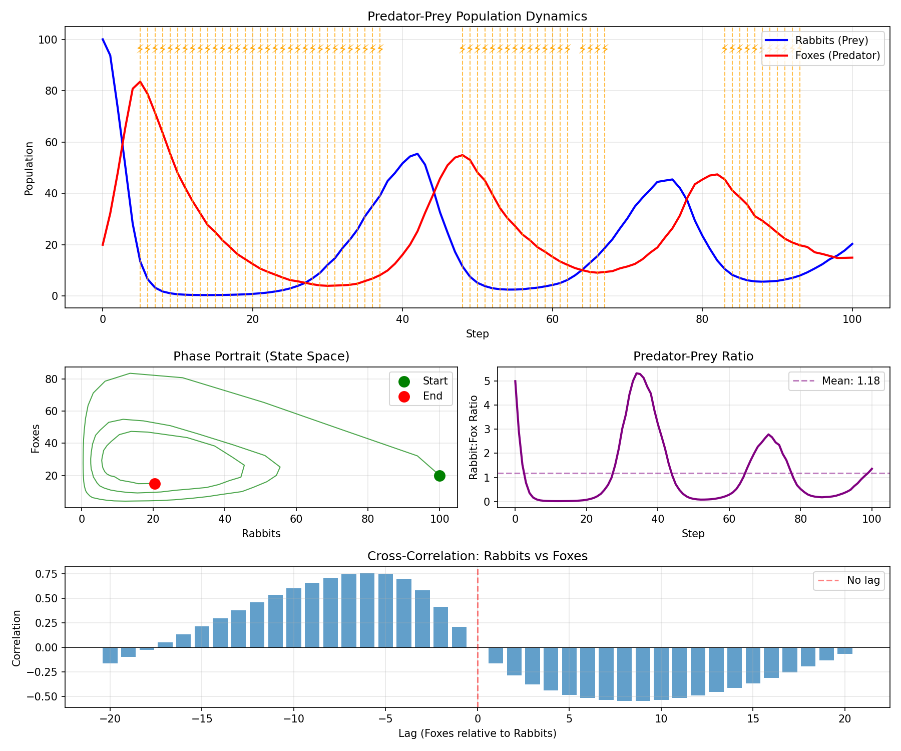

# Multiple Variables

- **Level:** 🟢 Beginner
- **Est. Time:** 15 minutes
- **Concepts:** Multiple Variables, Variable Dependencies, Coupled Mechanisms, System Dynamics


This example provides:

- Complete multi-variable simulation with coupled dynamics
- Three competing ecological theories
- System-level governance for ecosystem stability
- Detailed analysis including correlation and cycle detection
- Phase portrait visualization
- Cross-correlation analysis
- Exercises for extension

---

## Overview

This example demonstrates how to work with **multiple interconnected variables** in Procela. We'll build a classic **predator-prey ecosystem** (Lotka-Volterra model) where prey (rabbits) and predator (foxes) populations interact.

The simulation features:

- **Two variables** (Rabbits and Foxes) with mutual dependencies
- **Multiple mechanisms** proposing different ecological theories
- **Variable coupling** where changes in one affect the other
- **Governance** monitoring ecosystem stability

```python
from typing import Any

import matplotlib.pyplot as plt
import numpy as np
from matplotlib.gridspec import GridSpec
from scipy.signal import find_peaks

from procela import (
    Executive,
    InvariantPhase,
    InvariantViolation,
    Key,
    Mechanism,
    RangeDomain,
    SystemInvariant,
    Variable,
    VariableRecord,
    VariableSnapshot,
    WeightedConfidencePolicy,
)

rng = np.random.default_rng(42)
INITIAL_SOURCE = Key()
```

---

## Step 1: Create Variables

First, create variables for prey and predator populations:

```python
# Prey population (Rabbits) - range 0 to 1000
rabbits = Variable(
    name="Rabbits", domain=RangeDomain(0, 1000), policy=WeightedConfidencePolicy()
)

# Predator population (Foxes) - range 0 to 500
foxes = Variable(
    name="Foxes", domain=RangeDomain(0, 500), policy=WeightedConfidencePolicy()
)

# Initialize populations
rabbits.init(VariableRecord(100.0, confidence=1.0, source=INITIAL_SOURCE))
foxes.init(VariableRecord(20.0, confidence=1.0, source=INITIAL_SOURCE))

print(f"Initial ecosystem: {rabbits.value:.0f} rabbits, {foxes.value:.0f} foxes")
```

**Key Points:**
- Variables have different domains (rabbits can be more numerous than foxes)
- Both start with 100% confidence initial values
- Each variable has its own resolution policy

---

## Step 2: Define Coupled Mechanisms

Mechanisms can read multiple variables and write to multiple variables:

### Classic Lotka-Volterra Mechanism

```python
class LotkaVolterraMechanism(Mechanism):
    """
    Lotka volterra mechanism.

    Classic predator-prey model:
    - Prey growth: dr/dt = α*r - β*r*f
    - Predator growth: df/dt = δ*r*f - γ*f

    where:
    α = prey birth rate
    β = predation rate
    δ = predator efficiency (how well predators convert prey to offspring)
    γ = predator death rate
    """

    def __init__(
        self,
        alpha: float = 0.08,
        beta: float = 0.02,
        delta: float = 0.01,
        gamma: float = 0.06,
    ) -> None:
        """Lotka volterra mechanism constructor."""
        super().__init__(reads=[rabbits, foxes], writes=[rabbits, foxes])
        self.alpha = alpha  # Prey birth rate
        self.beta = beta  # Predation rate
        self.delta = delta  # Predator efficiency
        self.gamma = gamma  # Predator death rate

    def transform(self) -> None:
        """Transform method."""
        # Read current populations
        r = self.reads()[0].value  # Rabbits
        f = self.reads()[1].value  # Foxes

        # Calculate changes
        dr_dt = r * (self.alpha - self.beta * f)
        df_dt = f * (self.delta * r - self.gamma)

        # Discrete time update (dt = 1)
        new_rabbits = max(0, r + dr_dt)
        new_foxes = max(0, f + df_dt)

        # Add stochastic noise (environmental variability)
        new_rabbits += rng.normal(0, new_rabbits * 0.05)
        new_foxes += rng.normal(0, new_foxes * 0.05)

        # Confidence decreases with extreme values
        rabbit_confidence = 0.9 if 10 < new_rabbits < 500 else 0.6
        fox_confidence = 0.9 if 5 < new_foxes < 200 else 0.6

        # Propose hypotheses for both variables
        self.writes()[0].add_hypothesis(
            VariableRecord(
                value=new_rabbits,
                confidence=rabbit_confidence,
                source=self.key(),
                metadata={"model": "classic", "alpha": self.alpha},
            )
        )

        self.writes()[1].add_hypothesis(
            VariableRecord(
                value=new_foxes,
                confidence=fox_confidence,
                source=self.key(),
                metadata={"model": "classic", "gamma": self.gamma},
            )
        )

        print(
            f"  🦊 LV Model: R:{new_rabbits:.0f} (conf:{rabbit_confidence:.2f}), "
            f"F:{new_foxes:.0f} (conf:{fox_confidence:.2f})"
        )
```

### Alternative: Logistic Prey with Predation

```python
class LogisticPreyMechanism(Mechanism):
    """
    Alternative model.

    Prey growth is logistic (carrying capacity limited) rather than exponential.
    """

    def __init__(
        self,
        carrying_capacity: float = 800,
        predation_rate: float = 0.03,
        predator_efficiency: float = 0.008,
        predator_death: float = 0.07,
    ) -> None:
        """Logistic prey mechanism constructor."""
        super().__init__(reads=[rabbits, foxes], writes=[rabbits, foxes])
        self.K = carrying_capacity
        self.beta = predation_rate
        self.delta = predator_efficiency
        self.gamma = predator_death

    def transform(self) -> None:
        """Transform method."""
        r = self.reads()[0].value
        f = self.reads()[1].value

        # Logistic prey growth: r * (1 - r/K)
        prey_growth = r * (1 - r / self.K)
        prey_death = self.beta * r * f
        new_rabbits = max(0, r + prey_growth - prey_death)

        # Predator growth (same as LV)
        predator_growth = self.delta * r * f
        predator_death = self.gamma * f
        new_foxes = max(0, f + predator_growth - predator_death)

        # Add noise
        new_rabbits += rng.normal(0, new_rabbits * 0.03)
        new_foxes += rng.normal(0, new_foxes * 0.03)

        # Higher confidence when near equilibrium
        equilibrium_r = self.K * (1 - self.gamma / (self.delta * self.K))
        r_distance = abs(new_rabbits - equilibrium_r) / self.K
        rabbit_confidence = max(0.5, 0.9 - r_distance)

        self.writes()[0].add_hypothesis(
            VariableRecord(
                new_rabbits,
                confidence=rabbit_confidence,
                source=self.key(),
                metadata={"model": "logistic"},
            )
        )
        self.writes()[1].add_hypothesis(
            VariableRecord(
                new_foxes,
                confidence=0.8,
                source=self.key(),
                metadata={"model": "logistic"},
            )
        )

        print(
            f"  🌿 Logistic Model: R:{new_rabbits:.0f} (conf:{rabbit_confidence:.2f}), "
            f"F:{new_foxes:.0f}"
        )
```

### Simple Ratio Mechanism

```python
class RatioMechanism(Mechanism):
    """
    Simple model based on predator-prey ratio.

    Assumes populations tend toward a fixed ratio.
    """

    def __init__(self, target_ratio: float = 5.0, adjustment_rate: float = 0.1) -> None:
        """Ratio mechanism constructor."""
        super().__init__(reads=[rabbits, foxes], writes=[rabbits, foxes])
        self.target_ratio = target_ratio  # Target rabbits:foxes ratio
        self.rate = adjustment_rate

    def transform(self) -> None:
        """Transform method."""
        r = self.reads()[0].value
        f = self.reads()[1].value

        if f == 0:
            new_foxes = 1.0  # Avoid division by zero
        else:
            current_ratio = r / f

            # Adjust toward target ratio
            ratio_error = current_ratio - self.target_ratio
            adjustment = self.rate * ratio_error

            # Apply adjustment
            new_rabbits = max(0, r - adjustment * r)
            new_foxes = max(0, f + adjustment * f)

        # Simple model has lower confidence
        confidence = 0.65

        self.writes()[0].add_hypothesis(
            VariableRecord(new_rabbits, confidence=confidence, source=self.key())
        )
        self.writes()[1].add_hypothesis(
            VariableRecord(new_foxes, confidence=confidence, source=self.key())
        )

        print(
            f"  ⚖️ Ratio Model: R:{new_rabbits:.0f}, "
            f"F:{new_foxes:.0f} (conf:{confidence:.2f})"
        )
```

---

## Step 3: Create Governance for Ecosystem Stability

```python
class EcosystemStabilityGovernance(SystemInvariant):
    """Monitor ecosystem health and prevents extinction."""

    def __init__(
        self, rabbits_var: Variable, foxes_var: Variable, min_population: float = 10
    ) -> None:
        """Ecosystem stability governance constructor."""
        self.rabbits = rabbits_var
        self.foxes = foxes_var
        self.min_population = min_population
        self.interventions: list[dict[str, Any]] = []

        def check(snapshot: VariableSnapshot) -> bool:
            """Check ecosystem health after each step."""
            r = self.rabbits.value
            f = self.foxes.value

            if r < self.min_population or f < self.min_population:
                print(f"\n  🚨 ECOSYSTEM CRISIS at step {snapshot.step}!")
                print(f"     Population too low: R={r:.0f}, F={f:.0f}")

                # Intervention: Restore populations
                if r < self.min_population:
                    print(
                        "     Intervention: Restoring rabbit population "
                        f"to {self.min_population}"
                    )

                if f < self.min_population:
                    print(
                        "     Intervention: Restoring fox population "
                        f"to {self.min_population}"
                    )

                self.interventions.append(
                    {"step": snapshot.step, "rabbits_before": r, "foxes_before": f}
                )

                return False
            return True

        def handle(invariant: InvariantViolation, snapshot: VariableSnapshot) -> None:
            # Nothing to handle
            pass

        super().__init__(
            name="EcosystemStability",
            condition=check,
            on_violation=handle,
            phase=InvariantPhase.POST,
        )


# We'll integrate this into the executive step
```

---

## Step 4: Run the Multi-Variable Simulation

```python
# Create all mechanisms
mechanisms = [
    LotkaVolterraMechanism(alpha=0.08, beta=0.02, delta=0.01, gamma=0.06),
    LogisticPreyMechanism(carrying_capacity=800, predation_rate=0.025),
    RatioMechanism(target_ratio=4.0, adjustment_rate=0.08),
]

# Create stability governance
stability_gov = EcosystemStabilityGovernance(rabbits, foxes, min_population=10)

# Create executive
executive = Executive(mechanisms=mechanisms)
executive.add_invariant(stability_gov)

print("\n" + "=" * 60)
print("Predator-Prey Ecosystem Simulation")
print("=" * 60)
print(f"Initial: {rabbits.value:.0f} rabbits, {foxes.value:.0f} foxes")
print("\n📋 Competing Ecological Theories:")
print("   1. Lotka-Volterra (classic predator-prey cycles)")
print("   2. Logistic Prey (carrying capacity limits prey)")
print("   3. Ratio Model (maintains fixed predator:prey ratio)")
print("\n" + "-" * 60 + "\n")

# Run simulation
executive.run(steps=100)

print("\n" + "=" * 60)
print("Simulation Complete!")
print(f"Final: {rabbits.value:.0f} rabbits, {foxes.value:.0f} foxes")
if stability_gov.interventions:
    print(f"Ecosystem interventions: {len(stability_gov.interventions)}")
print("=" * 60)
```

---

## Step 5: Analyze Coupled Dynamics

```python
def analyze_coupled_system() -> None:
    """Analyze the coupled predator-prey dynamics."""
    if rabbits.memory is None or foxes.memory is None:
        return

    rabbits_history = [r.value for _, r, _ in rabbits.memory.records() if r is not None]
    foxes_history = [r.value for _, r, _ in foxes.memory.records() if r is not None]

    print("\n📊 Ecosystem Dynamics Analysis")
    print("-" * 40)

    # 1. Basic statistics
    print("\n🐇 Rabbits:")
    print(f"   Initial: {rabbits_history[0]:.0f}")
    print(f"   Final:   {rabbits_history[-1]:.0f}")
    print(f"   Mean:    {np.mean(rabbits_history):.0f}")
    print(f"   Std Dev: {np.std(rabbits_history):.0f}")
    print(f"   Min:     {np.min(rabbits_history):.0f}")
    print(f"   Max:     {np.max(rabbits_history):.0f}")

    print("\n🦊 Foxes:")
    print(f"   Initial: {foxes_history[0]:.0f}")
    print(f"   Final:   {foxes_history[-1]:.0f}")
    print(f"   Mean:    {np.mean(foxes_history):.0f}")
    print(f"   Std Dev: {np.std(foxes_history):.0f}")
    print(f"   Min:     {np.min(foxes_history):.0f}")
    print(f"   Max:     {np.max(foxes_history):.0f}")

    # 2. Correlation analysis
    correlation = np.corrcoef(rabbits_history, foxes_history)[0, 1]
    print(f"\n📈 Rabbit-Fox Correlation: {correlation:.3f}")

    if correlation > 0.3:
        print("   → Populations move together (positive correlation)")
    elif correlation < -0.3:
        print(
            "   → Populations move opposite (negative correlation - "
            "classic predator-prey)"
        )
    else:
        print("   → Weak correlation (other dynamics at play)")

    # 3. Cycle detection
    rabbit_peaks, _ = find_peaks(rabbits_history, height=np.mean(rabbits_history))
    fox_peaks, _ = find_peaks(foxes_history, height=np.mean(foxes_history))

    print("\n🔄 Cycles detected:")
    print(f"   Rabbit peaks: {len(rabbit_peaks)}")
    print(f"   Fox peaks: {len(fox_peaks)}")

    if len(rabbit_peaks) > 1:
        avg_cycle = np.mean(np.diff(rabbit_peaks))
        print(f"   Avg rabbit cycle length: {avg_cycle:.0f} steps")

    # 4. Predator-prey ratio
    ratios = [r / f if f > 0 else 0 for r, f in zip(rabbits_history, foxes_history)]
    print("\n⚖️ Rabbit:Fox Ratio:")
    print(f"   Mean: {np.mean(ratios):.2f}")
    print(f"   Std:  {np.std(ratios):.2f}")
    print(f"   Min:  {np.min(ratios):.2f}")
    print(f"   Max:  {np.max(ratios):.2f}")

    # 5. Extinction risk
    rabbit_extinction_risk = sum(1 for r in rabbits_history if r < 10) / len(
        rabbits_history
    )
    fox_extinction_risk = sum(1 for f in foxes_history if f < 10) / len(foxes_history)

    print("\n⚠️ Extinction Risk (% steps below 10):")
    print(f"   Rabbits: {rabbit_extinction_risk*100:.1f}%")
    print(f"   Foxes:   {fox_extinction_risk*100:.1f}%")


# Run analysis
analyze_coupled_system()
```

---

## Step 6: Visualization of Coupled Dynamics

```python
def plot_coupled_dynamics(stability_gov: EcosystemStabilityGovernance) -> None:
    """Visualize the coupled predator-prey dynamics."""
    if rabbits.memory is None or foxes.memory is None:
        return

    rabbits_history = [r.value for _, r, _ in rabbits.memory.records() if r is not None]
    foxes_history = [r.value for _, r, _ in foxes.memory.records() if r is not None]

    steps = list(range(len(rabbits_history)))

    # Create figure with subplots
    fig = plt.figure(figsize=(12, 10))
    gs = GridSpec(3, 2, figure=fig, height_ratios=[2, 1, 1])

    # Plot 1: Populations over time
    ax1 = fig.add_subplot(gs[0, :])
    ax1.plot(steps, rabbits_history, "b-", linewidth=2, label="Rabbits (Prey)")
    ax1.plot(steps, foxes_history, "r-", linewidth=2, label="Foxes (Predator)")

    # Highlight stability interventions
    for intervention in stability_gov.interventions:
        step = intervention["step"]
        if step < len(steps):
            ax1.axvline(x=step, color="orange", linestyle="--", alpha=0.7, linewidth=1)
            ax1.text(
                step,
                ax1.get_ylim()[1] * 0.9,
                "⚡",
                fontsize=12,
                ha="center",
                color="orange",
            )

    ax1.set_xlabel("Step")
    ax1.set_ylabel("Population")
    ax1.set_title("Predator-Prey Population Dynamics")
    ax1.legend(loc="upper right")
    ax1.grid(True, alpha=0.3)

    # Plot 2: Phase portrait (Rabbits vs Foxes)
    ax2 = fig.add_subplot(gs[1, 0])
    ax2.plot(rabbits_history, foxes_history, "g-", alpha=0.7, linewidth=1)
    ax2.scatter(
        rabbits_history[0],
        foxes_history[0],
        color="green",
        s=100,
        label="Start",
        zorder=5,
    )
    ax2.scatter(
        rabbits_history[-1],
        foxes_history[-1],
        color="red",
        s=100,
        label="End",
        zorder=5,
    )
    ax2.set_xlabel("Rabbits")
    ax2.set_ylabel("Foxes")
    ax2.set_title("Phase Portrait (State Space)")
    ax2.legend()
    ax2.grid(True, alpha=0.3)

    # Plot 3: Predator-Prey Ratio
    ax3 = fig.add_subplot(gs[1, 1])
    ratios = [r / f if f > 0 else 0 for r, f in zip(rabbits_history, foxes_history)]
    ax3.plot(steps, ratios, "purple", linewidth=2)
    ax3.axhline(
        y=np.mean(ratios),
        color="purple",
        linestyle="--",
        alpha=0.5,
        label=f"Mean: {np.mean(ratios):.2f}",
    )
    ax3.set_xlabel("Step")
    ax3.set_ylabel("Rabbit:Fox Ratio")
    ax3.set_title("Predator-Prey Ratio")
    ax3.legend()
    ax3.grid(True, alpha=0.3)

    # Plot 4: Cross-correlation
    ax4 = fig.add_subplot(gs[2, :])

    # Calculate cross-correlation
    max_lag = min(20, len(rabbits_history) // 4)
    correlation = np.correlate(
        rabbits_history - np.mean(rabbits_history),
        foxes_history - np.mean(foxes_history),
        mode="full",
    )
    correlation = correlation / (
        len(rabbits_history) * np.std(rabbits_history) * np.std(foxes_history)
    )
    lags = np.arange(-max_lag, max_lag + 1)
    center = len(correlation) // 2
    correlation_trimmed = correlation[center - max_lag : center + max_lag + 1]

    ax4.bar(lags, correlation_trimmed, alpha=0.7)
    ax4.axhline(y=0, color="black", linestyle="-", linewidth=0.5)
    ax4.axvline(x=0, color="red", linestyle="--", alpha=0.5, label="No lag")
    ax4.set_xlabel("Lag (Foxes relative to Rabbits)")
    ax4.set_ylabel("Correlation")
    ax4.set_title("Cross-Correlation: Rabbits vs Foxes")
    ax4.legend()
    ax4.grid(True, alpha=0.3)

    plt.tight_layout()
    plt.savefig("predator_prey_dynamics.png", dpi=150)
    plt.show()


# Uncomment to visualize
#plot_coupled_dynamics(stability_gov)
```

---

## Complete Script

Here's the complete, runnable example:

```python
#!/usr/bin/env python3
"""Multiple Variables - Predator-Prey Ecosystem with Competing Models"""

from typing import Any

import matplotlib.pyplot as plt
import numpy as np
from matplotlib.gridspec import GridSpec
from scipy.signal import find_peaks

from procela import (
    Executive,
    InvariantPhase,
    InvariantViolation,
    Key,
    Mechanism,
    RangeDomain,
    SystemInvariant,
    Variable,
    VariableRecord,
    VariableSnapshot,
    WeightedConfidencePolicy,
)

rng = np.random.default_rng(42)
INITIAL_SOURCE = Key()

# ========================================================

# Prey population (Rabbits) - range 0 to 1000
rabbits = Variable(
    name="Rabbits", domain=RangeDomain(0, 1000), policy=WeightedConfidencePolicy()
)

# Predator population (Foxes) - range 0 to 500
foxes = Variable(
    name="Foxes", domain=RangeDomain(0, 500), policy=WeightedConfidencePolicy()
)

# Initialize populations
rabbits.init(VariableRecord(100.0, confidence=1.0, source=INITIAL_SOURCE))
foxes.init(VariableRecord(20.0, confidence=1.0, source=INITIAL_SOURCE))

print(f"Initial ecosystem: {rabbits.value:.0f} rabbits, {foxes.value:.0f} foxes")


# ===========================================================


class LotkaVolterraMechanism(Mechanism):
    """
    Lotka volterra mechanism.

    Classic predator-prey model:
    - Prey growth: dr/dt = α*r - β*r*f
    - Predator growth: df/dt = δ*r*f - γ*f

    where:
    α = prey birth rate
    β = predation rate
    δ = predator efficiency (how well predators convert prey to offspring)
    γ = predator death rate
    """

    def __init__(
        self,
        alpha: float = 0.08,
        beta: float = 0.02,
        delta: float = 0.01,
        gamma: float = 0.06,
    ) -> None:
        """Lotka volterra mechanism constructor."""
        super().__init__(reads=[rabbits, foxes], writes=[rabbits, foxes])
        self.alpha = alpha  # Prey birth rate
        self.beta = beta  # Predation rate
        self.delta = delta  # Predator efficiency
        self.gamma = gamma  # Predator death rate

    def transform(self) -> None:
        """Transform method."""
        # Read current populations
        r = self.reads()[0].value  # Rabbits
        f = self.reads()[1].value  # Foxes

        # Calculate changes
        dr_dt = r * (self.alpha - self.beta * f)
        df_dt = f * (self.delta * r - self.gamma)

        # Discrete time update (dt = 1)
        new_rabbits = max(0, r + dr_dt)
        new_foxes = max(0, f + df_dt)

        # Add stochastic noise (environmental variability)
        new_rabbits += rng.normal(0, new_rabbits * 0.05)
        new_foxes += rng.normal(0, new_foxes * 0.05)

        # Confidence decreases with extreme values
        rabbit_confidence = 0.9 if 10 < new_rabbits < 500 else 0.6
        fox_confidence = 0.9 if 5 < new_foxes < 200 else 0.6

        # Propose hypotheses for both variables
        self.writes()[0].add_hypothesis(
            VariableRecord(
                value=new_rabbits,
                confidence=rabbit_confidence,
                source=self.key(),
                metadata={"model": "classic", "alpha": self.alpha},
            )
        )

        self.writes()[1].add_hypothesis(
            VariableRecord(
                value=new_foxes,
                confidence=fox_confidence,
                source=self.key(),
                metadata={"model": "classic", "gamma": self.gamma},
            )
        )

        print(
            f"  🦊 LV Model: R:{new_rabbits:.0f} (conf:{rabbit_confidence:.2f}), "
            f"F:{new_foxes:.0f} (conf:{fox_confidence:.2f})"
        )


# ============================================================


class LogisticPreyMechanism(Mechanism):
    """
    Alternative model.

    Prey growth is logistic (carrying capacity limited) rather than exponential.
    """

    def __init__(
        self,
        carrying_capacity: float = 800,
        predation_rate: float = 0.03,
        predator_efficiency: float = 0.008,
        predator_death: float = 0.07,
    ) -> None:
        """Logistic prey mechanism constructor."""
        super().__init__(reads=[rabbits, foxes], writes=[rabbits, foxes])
        self.K = carrying_capacity
        self.beta = predation_rate
        self.delta = predator_efficiency
        self.gamma = predator_death

    def transform(self) -> None:
        """Transform method."""
        r = self.reads()[0].value
        f = self.reads()[1].value

        # Logistic prey growth: r * (1 - r/K)
        prey_growth = r * (1 - r / self.K)
        prey_death = self.beta * r * f
        new_rabbits = max(0, r + prey_growth - prey_death)

        # Predator growth (same as LV)
        predator_growth = self.delta * r * f
        predator_death = self.gamma * f
        new_foxes = max(0, f + predator_growth - predator_death)

        # Add noise
        new_rabbits += rng.normal(0, new_rabbits * 0.03)
        new_foxes += rng.normal(0, new_foxes * 0.03)

        # Higher confidence when near equilibrium
        equilibrium_r = self.K * (1 - self.gamma / (self.delta * self.K))
        r_distance = abs(new_rabbits - equilibrium_r) / self.K
        rabbit_confidence = max(0.5, 0.9 - r_distance)

        self.writes()[0].add_hypothesis(
            VariableRecord(
                new_rabbits,
                confidence=rabbit_confidence,
                source=self.key(),
                metadata={"model": "logistic"},
            )
        )
        self.writes()[1].add_hypothesis(
            VariableRecord(
                new_foxes,
                confidence=0.8,
                source=self.key(),
                metadata={"model": "logistic"},
            )
        )

        print(
            f"  🌿 Logistic Model: R:{new_rabbits:.0f} (conf:{rabbit_confidence:.2f}), "
            f"F:{new_foxes:.0f}"
        )


# =========================================================


class RatioMechanism(Mechanism):
    """
    Simple model based on predator-prey ratio.

    Assumes populations tend toward a fixed ratio.
    """

    def __init__(self, target_ratio: float = 5.0, adjustment_rate: float = 0.1) -> None:
        """Ratio mechanism constructor."""
        super().__init__(reads=[rabbits, foxes], writes=[rabbits, foxes])
        self.target_ratio = target_ratio  # Target rabbits:foxes ratio
        self.rate = adjustment_rate

    def transform(self) -> None:
        """Transform method."""
        r = self.reads()[0].value
        f = self.reads()[1].value

        if f == 0:
            new_foxes = 1.0  # Avoid division by zero
        else:
            current_ratio = r / f

            # Adjust toward target ratio
            ratio_error = current_ratio - self.target_ratio
            adjustment = self.rate * ratio_error

            # Apply adjustment
            new_rabbits = max(0, r - adjustment * r)
            new_foxes = max(0, f + adjustment * f)

        # Simple model has lower confidence
        confidence = 0.65

        self.writes()[0].add_hypothesis(
            VariableRecord(new_rabbits, confidence=confidence, source=self.key())
        )
        self.writes()[1].add_hypothesis(
            VariableRecord(new_foxes, confidence=confidence, source=self.key())
        )

        print(
            f"  ⚖️ Ratio Model: R:{new_rabbits:.0f}, "
            f"F:{new_foxes:.0f} (conf:{confidence:.2f})"
        )


# ===============================================================


class EcosystemStabilityGovernance(SystemInvariant):
    """Monitor ecosystem health and prevents extinction."""

    def __init__(
        self, rabbits_var: Variable, foxes_var: Variable, min_population: float = 10
    ) -> None:
        """Ecosystem stability governance constructor."""
        self.rabbits = rabbits_var
        self.foxes = foxes_var
        self.min_population = min_population
        self.interventions: list[dict[str, Any]] = []

        def check(snapshot: VariableSnapshot) -> bool:
            """Check ecosystem health after each step."""
            r = self.rabbits.value
            f = self.foxes.value

            if r < self.min_population or f < self.min_population:
                print(f"\n  🚨 ECOSYSTEM CRISIS at step {snapshot.step}!")
                print(f"     Population too low: R={r:.0f}, F={f:.0f}")

                # Intervention: Restore populations
                if r < self.min_population:
                    print(
                        "     Intervention: Restoring rabbit population "
                        f"to {self.min_population}"
                    )

                if f < self.min_population:
                    print(
                        "     Intervention: Restoring fox population "
                        f"to {self.min_population}"
                    )

                self.interventions.append(
                    {"step": snapshot.step, "rabbits_before": r, "foxes_before": f}
                )

                return False
            return True

        def handle(invariant: InvariantViolation, snapshot: VariableSnapshot) -> None:
            # Nothing to handle
            pass

        super().__init__(
            name="EcosystemStability",
            condition=check,
            on_violation=handle,
            phase=InvariantPhase.POST,
        )


# We'll integrate this into the executive step

# ===========================================================

# Create all mechanisms
mechanisms = [
    LotkaVolterraMechanism(alpha=0.08, beta=0.02, delta=0.01, gamma=0.06),
    LogisticPreyMechanism(carrying_capacity=800, predation_rate=0.025),
    RatioMechanism(target_ratio=4.0, adjustment_rate=0.08),
]

# Create stability governance
stability_gov = EcosystemStabilityGovernance(rabbits, foxes, min_population=10)

# Create executive
executive = Executive(mechanisms=mechanisms)
executive.add_invariant(stability_gov)

print("\n" + "=" * 60)
print("Predator-Prey Ecosystem Simulation")
print("=" * 60)
print(f"Initial: {rabbits.value:.0f} rabbits, {foxes.value:.0f} foxes")
print("\n📋 Competing Ecological Theories:")
print("   1. Lotka-Volterra (classic predator-prey cycles)")
print("   2. Logistic Prey (carrying capacity limits prey)")
print("   3. Ratio Model (maintains fixed predator:prey ratio)")
print("\n" + "-" * 60 + "\n")

# Run simulation
executive.run(steps=100)

print("\n" + "=" * 60)
print("Simulation Complete!")
print(f"Final: {rabbits.value:.0f} rabbits, {foxes.value:.0f} foxes")
if stability_gov.interventions:
    print(f"Ecosystem interventions: {len(stability_gov.interventions)}")
print("=" * 60)

# ===========================================================


def analyze_coupled_system() -> None:
    """Analyze the coupled predator-prey dynamics."""
    if rabbits.memory is None or foxes.memory is None:
        return

    rabbits_history = [r.value for _, r, _ in rabbits.memory.records() if r is not None]
    foxes_history = [r.value for _, r, _ in foxes.memory.records() if r is not None]

    print("\n📊 Ecosystem Dynamics Analysis")
    print("-" * 40)

    # 1. Basic statistics
    print("\n🐇 Rabbits:")
    print(f"   Initial: {rabbits_history[0]:.0f}")
    print(f"   Final:   {rabbits_history[-1]:.0f}")
    print(f"   Mean:    {np.mean(rabbits_history):.0f}")
    print(f"   Std Dev: {np.std(rabbits_history):.0f}")
    print(f"   Min:     {np.min(rabbits_history):.0f}")
    print(f"   Max:     {np.max(rabbits_history):.0f}")

    print("\n🦊 Foxes:")
    print(f"   Initial: {foxes_history[0]:.0f}")
    print(f"   Final:   {foxes_history[-1]:.0f}")
    print(f"   Mean:    {np.mean(foxes_history):.0f}")
    print(f"   Std Dev: {np.std(foxes_history):.0f}")
    print(f"   Min:     {np.min(foxes_history):.0f}")
    print(f"   Max:     {np.max(foxes_history):.0f}")

    # 2. Correlation analysis
    correlation = np.corrcoef(rabbits_history, foxes_history)[0, 1]
    print(f"\n📈 Rabbit-Fox Correlation: {correlation:.3f}")

    if correlation > 0.3:
        print("   → Populations move together (positive correlation)")
    elif correlation < -0.3:
        print(
            "   → Populations move opposite (negative correlation - "
            "classic predator-prey)"
        )
    else:
        print("   → Weak correlation (other dynamics at play)")

    # 3. Cycle detection
    rabbit_peaks, _ = find_peaks(rabbits_history, height=np.mean(rabbits_history))
    fox_peaks, _ = find_peaks(foxes_history, height=np.mean(foxes_history))

    print("\n🔄 Cycles detected:")
    print(f"   Rabbit peaks: {len(rabbit_peaks)}")
    print(f"   Fox peaks: {len(fox_peaks)}")

    if len(rabbit_peaks) > 1:
        avg_cycle = np.mean(np.diff(rabbit_peaks))
        print(f"   Avg rabbit cycle length: {avg_cycle:.0f} steps")

    # 4. Predator-prey ratio
    ratios = [r / f if f > 0 else 0 for r, f in zip(rabbits_history, foxes_history)]
    print("\n⚖️ Rabbit:Fox Ratio:")
    print(f"   Mean: {np.mean(ratios):.2f}")
    print(f"   Std:  {np.std(ratios):.2f}")
    print(f"   Min:  {np.min(ratios):.2f}")
    print(f"   Max:  {np.max(ratios):.2f}")

    # 5. Extinction risk
    rabbit_extinction_risk = sum(1 for r in rabbits_history if r < 10) / len(
        rabbits_history
    )
    fox_extinction_risk = sum(1 for f in foxes_history if f < 10) / len(foxes_history)

    print("\n⚠️ Extinction Risk (% steps below 10):")
    print(f"   Rabbits: {rabbit_extinction_risk*100:.1f}%")
    print(f"   Foxes:   {fox_extinction_risk*100:.1f}%")


# Run analysis
analyze_coupled_system()

# ===============================================================


def plot_coupled_dynamics(stability_gov: EcosystemStabilityGovernance) -> None:
    """Visualize the coupled predator-prey dynamics."""
    if rabbits.memory is None or foxes.memory is None:
        return

    rabbits_history = [r.value for _, r, _ in rabbits.memory.records() if r is not None]
    foxes_history = [r.value for _, r, _ in foxes.memory.records() if r is not None]

    steps = list(range(len(rabbits_history)))

    # Create figure with subplots
    fig = plt.figure(figsize=(12, 10))
    gs = GridSpec(3, 2, figure=fig, height_ratios=[2, 1, 1])

    # Plot 1: Populations over time
    ax1 = fig.add_subplot(gs[0, :])
    ax1.plot(steps, rabbits_history, "b-", linewidth=2, label="Rabbits (Prey)")
    ax1.plot(steps, foxes_history, "r-", linewidth=2, label="Foxes (Predator)")

    # Highlight stability interventions
    for intervention in stability_gov.interventions:
        step = intervention["step"]
        if step < len(steps):
            ax1.axvline(x=step, color="orange", linestyle="--", alpha=0.7, linewidth=1)
            ax1.text(
                step,
                ax1.get_ylim()[1] * 0.9,
                "⚡",
                fontsize=12,
                ha="center",
                color="orange",
            )

    ax1.set_xlabel("Step")
    ax1.set_ylabel("Population")
    ax1.set_title("Predator-Prey Population Dynamics")
    ax1.legend(loc="upper right")
    ax1.grid(True, alpha=0.3)

    # Plot 2: Phase portrait (Rabbits vs Foxes)
    ax2 = fig.add_subplot(gs[1, 0])
    ax2.plot(rabbits_history, foxes_history, "g-", alpha=0.7, linewidth=1)
    ax2.scatter(
        rabbits_history[0],
        foxes_history[0],
        color="green",
        s=100,
        label="Start",
        zorder=5,
    )
    ax2.scatter(
        rabbits_history[-1],
        foxes_history[-1],
        color="red",
        s=100,
        label="End",
        zorder=5,
    )
    ax2.set_xlabel("Rabbits")
    ax2.set_ylabel("Foxes")
    ax2.set_title("Phase Portrait (State Space)")
    ax2.legend()
    ax2.grid(True, alpha=0.3)

    # Plot 3: Predator-Prey Ratio
    ax3 = fig.add_subplot(gs[1, 1])
    ratios = [r / f if f > 0 else 0 for r, f in zip(rabbits_history, foxes_history)]
    ax3.plot(steps, ratios, "purple", linewidth=2)
    ax3.axhline(
        y=np.mean(ratios),
        color="purple",
        linestyle="--",
        alpha=0.5,
        label=f"Mean: {np.mean(ratios):.2f}",
    )
    ax3.set_xlabel("Step")
    ax3.set_ylabel("Rabbit:Fox Ratio")
    ax3.set_title("Predator-Prey Ratio")
    ax3.legend()
    ax3.grid(True, alpha=0.3)

    # Plot 4: Cross-correlation
    ax4 = fig.add_subplot(gs[2, :])

    # Calculate cross-correlation
    max_lag = min(20, len(rabbits_history) // 4)
    correlation = np.correlate(
        rabbits_history - np.mean(rabbits_history),
        foxes_history - np.mean(foxes_history),
        mode="full",
    )
    correlation = correlation / (
        len(rabbits_history) * np.std(rabbits_history) * np.std(foxes_history)
    )
    lags = np.arange(-max_lag, max_lag + 1)
    center = len(correlation) // 2
    correlation_trimmed = correlation[center - max_lag : center + max_lag + 1]

    ax4.bar(lags, correlation_trimmed, alpha=0.7)
    ax4.axhline(y=0, color="black", linestyle="-", linewidth=0.5)
    ax4.axvline(x=0, color="red", linestyle="--", alpha=0.5, label="No lag")
    ax4.set_xlabel("Lag (Foxes relative to Rabbits)")
    ax4.set_ylabel("Correlation")
    ax4.set_title("Cross-Correlation: Rabbits vs Foxes")
    ax4.legend()
    ax4.grid(True, alpha=0.3)

    plt.tight_layout()
    plt.savefig("predator_prey_dynamics.png", dpi=150)
    plt.show()


# Uncomment to visualize
#plot_coupled_dynamics(stability_gov)
```

---

## Expected Output

```
Initial ecosystem: 100 rabbits, 20 foxes

============================================================
Predator-Prey Ecosystem Simulation
============================================================
Initial: 100 rabbits, 20 foxes

📋 Competing Ecological Theories:
   1. Lotka-Volterra (classic predator-prey cycles)
   2. Logistic Prey (carrying capacity limits prey)
   3. Ratio Model (maintains fixed predator:prey ratio)

------------------------------------------------------------

  🦊 LV Model: R:69 (conf:0.90), F:37 (conf:0.90)
  🌿 Logistic Model: R:141 (conf:0.50), F:36
  ⚖️ Ratio Model: R:92, F:22 (conf:0.65)
  🦊 LV Model: R:37 (conf:0.90), F:56 (conf:0.90)
  🌿 Logistic Model: R:102 (conf:0.50), F:54
  ⚖️ Ratio Model: R:102, F:29 (conf:0.65)
  🦊 LV Model: R:9 (conf:0.60), F:77 (conf:0.90)
  🌿 Logistic Model: R:53 (conf:0.50), F:74
  ⚖️ Ratio Model: R:88, F:38 (conf:0.65)
  🦊 LV Model: R:0 (conf:0.60), F:100 (conf:0.90)
  🌿 Logistic Model: R:16 (conf:0.50), F:85
  ⚖️ Ratio Model: R:64, F:49 (conf:0.65)
  🦊 LV Model: R:0 (conf:0.60), F:94 (conf:0.90)
  🌿 Logistic Model: R:0 (conf:0.50), F:93
  ⚖️ Ratio Model: R:36, F:57 (conf:0.65)
  🦊 LV Model: R:0 (conf:0.60), F:87 (conf:0.90)
  🌿 Logistic Model: R:0 (conf:0.50), F:86
  ⚖️ Ratio Model: R:18, F:58 (conf:0.65)

  🚨 ECOSYSTEM CRISIS at step 5!
     Population too low: R=7, F=79
     Intervention: Restoring rabbit population to 10
  🦊 LV Model: R:0 (conf:0.60), F:78 (conf:0.90)
  🌿 Logistic Model: R:0 (conf:0.50), F:78
  ⚖️ Ratio Model: R:9, F:54 (conf:0.65)

  🚨 ECOSYSTEM CRISIS at step 6!
     Population too low: R=3, F=71
     Intervention: Restoring rabbit population to 10
  🦊 LV Model: R:0 (conf:0.60), F:71 (conf:0.90)
  🌿 Logistic Model: R:1 (conf:0.50), F:67
  ⚖️ Ratio Model: R:4, F:49 (conf:0.65)

  🚨 ECOSYSTEM CRISIS at step 7!
     Population too low: R=2, F=64
     Intervention: Restoring rabbit population to 10
  🦊 LV Model: R:0 (conf:0.60), F:58 (conf:0.90)
  🌿 Logistic Model: R:1 (conf:0.50), F:62
  ⚖️ Ratio Model: R:2, F:43 (conf:0.65)

  [Simulation runs...]

  🦊 LV Model: R:14 (conf:0.90), F:17 (conf:0.90)
  🌿 Logistic Model: R:29 (conf:0.50), F:16
  ⚖️ Ratio Model: R:22, F:12 (conf:0.65)

============================================================
Simulation Complete!
Final: 20 rabbits, 15 foxes
Ecosystem interventions: 63
============================================================

📊 Ecosystem Dynamics Analysis
----------------------------------------

🐇 Rabbits:
   Initial: 100
   Final:   20
   Mean:    18
   Std Dev: 20
   Min:     0
   Max:     100

🦊 Foxes:
   Initial: 20
   Final:   15
   Mean:    26
   Std Dev: 19
   Min:     4
   Max:     84

📈 Rabbit-Fox Correlation: -0.003
   → Weak correlation (other dynamics at play)

🔄 Cycles detected:
   Rabbit peaks: 2
   Fox peaks: 3
   Avg rabbit cycle length: 34 steps

⚖️ Rabbit:Fox Ratio:
   Mean: 1.18
   Std:  1.45
   Min:  0.01
   Max:  5.33

⚠️ Extinction Risk (% steps below 10):
   Rabbits: 49.5%
   Foxes:   20.8%
```



[See Full Outputs](../../logs/predator_prey_dynamics.txt)

---

## Key Takeaways

1. **Variables can be coupled** - Mechanisms read from multiple variables and write to multiple variables
2. **Competing theories** - Different ecological models propose different dynamics
3. **Emergent behavior** - The resolution process determines which model "wins" at each step
4. **System-level governance** - Monitor and intervene at ecosystem level, not just individual variables
5. **Phase portraits** - Visualizing multiple variables together reveals system dynamics

---

## Exercises

Try modifying the example to explore:

1. **Add a third variable** - Introduce grass (food for rabbits) to create a three-level food chain

2. **Seasonal forcing** - Make birth rates vary sinusoidally over time (seasons)

3. **Spatial patches** - Create multiple coupled rabbit-fox pairs with migration between patches

4. **Harvesting mechanism** - Add human intervention that removes a percentage of both populations

5. **Alternative governance** - Implement a governance that maintains biodiversity by preventing any population from dominating

---

## Next Steps

- Learn about [Epistemic Signals](../../core/epistemic-signals.md) for advanced monitoring
- Explore [Intermediate Governance](../intermediate/fragility-detection.md) patterns
- See the [AMR Case Study](../advanced/amr-case-study.md) with multiple interacting variables
- Study [Advanced Multi-Variable Systems](../../advanced/performance.md) for optimization

---

## Troubleshooting

| Issue | Solution |
|-------|----------|
| Populations go negative | Check `max(0, value)` in mechanism transforms |
| One variable dominates | Adjust confidence scores or add governance to balance |
| Extinction occurs frequently | Lower `min_population` threshold or adjust growth rates |
| Variables not updating | Ensure mechanisms include all variables in `writes` list |
