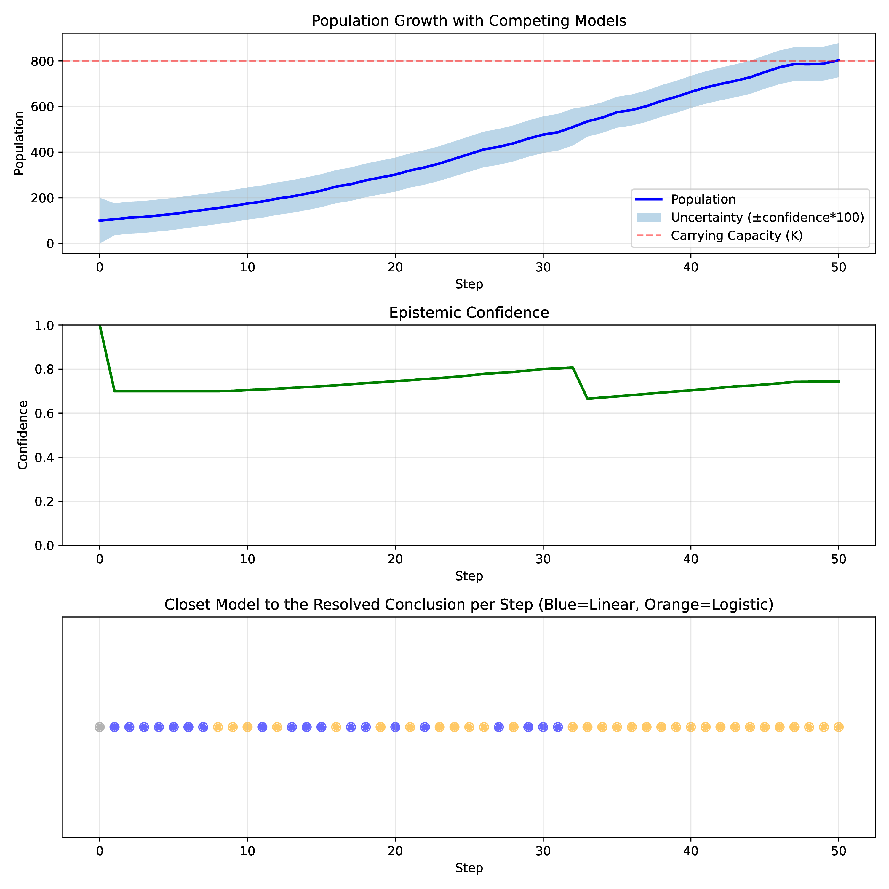

# Simple Growth Model

- **Level:** 🟢 Beginner
- **Est. Time:** 10 minutes
- **Concepts:** Variables, Mechanisms, Executive, Basic Competition

This example provides:

- Complete, runnable code with clear comments
- Two competing mechanisms with different growth theories
- Step-by-step explanation of each component
- Analysis and visualization code
- Expected output to verify correctness
- Exercises for further exploration
- Clear connections to core concepts

---

## Overview

This example demonstrates a classic population growth scenario with two competing theories:
- **Linear Growth** - Assumes unlimited exponential growth
- **Logistic Growth** - Assumes growth limited by carrying capacity

The simulation runs both mechanisms simultaneously, and the variable resolves their competing hypotheses using a weighted voting policy.

```python
import matplotlib.pyplot as plt
import numpy as np

from procela import (
    Executive,
    HypothesisRecord,
    Mechanism,
    RangeDomain,
    Variable,
    VariableRecord,
    WeightedConfidencePolicy,
)

rng = np.random.default_rng(42)
```

---

## Step 1: Create the Variable

First, create a variable to represent population size:

```python
# Population variable with realistic bounds (0 to 1000)
population = Variable(
    name="Population",
    domain=RangeDomain(0, 1000),
    policy=WeightedConfidencePolicy(),  # Weighted by confidence
)

# Initialize at 100 individuals
population.init(VariableRecord(value=100.0, confidence=1.0, source=None))

print(f"Initial population: {population.value}")
```

**Key Points:**

- Domain `(0, 1000)` prevents impossible negative or unrealistic values
- `WeightedConfidencePolicy` gives more influence to high-confidence predictions
- Initial value of 100 represents the starting population

---

## Step 2: Define the Linear Growth Mechanism

The linear growth mechanism assumes unlimited exponential growth:

```python
class LinearGrowthMechanism(Mechanism):
    """Assumes population grows exponentially without limits."""

    def __init__(self, growth_rate: float = 0.05) -> None:
        """Linear growth mechanism constructor."""
        super().__init__(reads=[population], writes=[population])
        self.growth_rate = growth_rate

    def transform(self) -> None:
        """Transform method."""
        current = self.reads()[0].value

        # Linear (exponential) growth model
        # P(t+1) = P(t) * (1 + r)
        new_population = current * (1 + self.growth_rate)

        # Add small random noise to simulate environmental variability
        noise = rng.normal(0, current * 0.02)
        new_population += noise

        # Confidence decreases as population grows (more uncertainty)
        confidence = 0.9 if current < 500 else 0.6

        self.writes()[0].add_hypothesis(
            VariableRecord(
                value=new_population,
                confidence=confidence,
                source=self.key(),
                metadata={"model": "linear", "growth_rate": self.growth_rate},
            )
        )
        print(
            f"  📈 Linear model predicts: {new_population:.1f} (conf: {confidence:.2f})"
        )
```

**How it works:**

- Reads current population value
- Applies exponential growth formula
- Confidence is higher for smaller populations (more predictable)
- Proposes hypothesis without directly modifying the variable

---

## Step 3: Define the Logistic Growth Mechanism

The logistic growth mechanism accounts for carrying capacity:

```python
class LogisticGrowthMechanism(Mechanism):
    """Assumes growth limited by carrying capacity (environmental limits)."""

    def __init__(
        self, carrying_capacity: float = 800, growth_rate: float = 0.08
    ) -> None:
        """Logistic growth mechanism constructor."""
        super().__init__(reads=[population], writes=[population])
        self.K = carrying_capacity  # Carrying capacity
        self.r = growth_rate  # Maximum growth rate

    def transform(self) -> None:
        """Transform method."""
        current = self.reads()[0].value

        # Logistic growth model
        # P(t+1) = P(t) + r * P(t) * (1 - P(t)/K)
        if current < self.K:
            growth = self.r * current * (1 - current / self.K)
            new_population = current + growth
        else:
            # At or above carrying capacity, population declines
            new_population = current * 0.95

        # Add small random noise
        noise = rng.normal(0, current * 0.01)
        new_population += noise

        # Confidence is higher when population is near equilibrium
        distance_to_capacity = abs(new_population - self.K) / self.K
        confidence = 0.9 - distance_to_capacity * 0.5
        confidence = max(0.5, min(0.95, confidence))

        self.writes()[0].add_hypothesis(
            VariableRecord(
                value=new_population,
                confidence=confidence,
                source=self.key(),
                metadata={"model": "logistic", "K": self.K, "r": self.r},
            )
        )
        print(
            f"  📉 Logistic model predicts: {new_population:.1f} "
            f"(conf: {confidence:.2f})"
        )
```

**How it works:**

- Growth slows as population approaches carrying capacity (K)
- Population can't exceed environmental limits
- Confidence is highest when population is stable near carrying capacity
- Models realistic population dynamics

---

## Step 4: Create and Run the Simulation

```python
# Create both mechanisms
mechanisms = [
    LinearGrowthMechanism(growth_rate=0.05),
    LogisticGrowthMechanism(carrying_capacity=800, growth_rate=0.08),
]

# Create executive
executive = Executive(mechanisms=mechanisms, rng=rng)

# Run simulation
print("\n" + "=" * 50)
print("Starting Population Growth Simulation")
print("=" * 50 + "\n")

executive.run(steps=50)

print("\n" + "=" * 50)
print("Simulation Complete!")
print(f"Final population: {population.value:.1f}")
print("=" * 50)
```

---

## Step 5: Analyze Results

Let's analyze what happened during the simulation:

```python
def analyze_growth_simulation(population: Variable) -> None:
    """Analyze and visualize the competition between growth models."""
    print("\n📊 Growth Model Competition Analysis")
    print("-" * 40)

    # Extract memory
    memory = population.memory
    if memory is None:
        return

    # Track confidence over time
    confidences = [r.confidence for _, r, _ in memory.records() if r is not None]
    print("\nConfidence statistics:")
    print(f"  Mean confidence: {np.mean(confidences):.3f}")
    print(f"  Min confidence:  {np.min(confidences):.3f}")
    print(f"  Max confidence:  {np.max(confidences):.3f}")

    # Growth analysis
    values = [r.value for _, r, _ in memory.records() if r is not None]
    initial = values[0]
    final = values[-1]
    total_growth = final - initial
    growth_rate_per_step = total_growth / len(values)

    print("\nPopulation dynamics:")
    print(f"  Initial: {initial:.1f}")
    print(f"  Final:   {final:.1f}")
    print(f"  Total growth: {total_growth:+.1f}")
    print(f"  Avg growth per step: {growth_rate_per_step:.2f}")

    # Check if population stabilized
    if len(values) > 20:
        recent = values[-20:]
        stability = np.std(recent) / np.mean(recent)
        if stability < 0.05:
            print(f"  Population stabilized at ≈ {np.mean(recent):.0f}")


# Run analysis
analyze_growth_simulation(population)
```

---

## Step 6: Visualization (Optional)

For a clearer picture of the competition:

```python
def plot_growth_simulation(population: Variable) -> None:
    """Plot population growth and model competition."""
    memory = population.memory
    if memory is None:
        return

    records = memory.records()
    values = [r.value for _, r, _ in records if r is not None]
    confidences = [r.confidence for _, r, _ in records if r is not None]
    steps = list(range(len(values)))

    # Identify which model was closest to the resolved conclusion at each step
    def closest_model(h: tuple[HypothesisRecord, ...], r: VariableRecord | None) -> str:
        if not h or r is None:
            return "unknown"

        distances = {
            hi.record: hi.record.value - r.value for hi in h if hi.record is not None
        }
        closest = min(distances.items(), key=lambda d: d[1])
        model = (
            closest[0].metadata.get("model", "unknown")
            if closest[0] is not None
            else "unknown"
        )
        return str(model)

    models = []
    for h, r, _ in records:
        models.append(closest_model(h, r))

    fig, (ax1, ax2, ax3) = plt.subplots(3, 1, figsize=(10.0, 10.0))

    # Plot 1: Population over time
    ax1.plot(steps, values, "b-", linewidth=2, label="Population")
    ax1.fill_between(
        steps,
        [
            v - c * 100
            for v, c in zip(values, confidences)
            if v is not None and c is not None
        ],
        [
            v + c * 100
            for v, c in zip(values, confidences)
            if v is not None and c is not None
        ],
        alpha=0.3,
        label="Uncertainty (±confidence*100)",
    )
    ax1.axhline(
        y=800, color="r", linestyle="--", alpha=0.5, label="Carrying Capacity (K)"
    )
    ax1.set_xlabel("Step")
    ax1.set_ylabel("Population")
    ax1.set_title("Population Growth with Competing Models")
    ax1.legend()
    ax1.grid(True, alpha=0.3)

    # Plot 2: Confidence over time
    ax2.plot(steps, confidences, "g-", linewidth=2)
    ax2.set_xlabel("Step")
    ax2.set_ylabel("Confidence")
    ax2.set_title("Epistemic Confidence")
    ax2.set_ylim([0, 1])
    ax2.grid(True, alpha=0.3)

    # Plot 3: Model acceptance (color-coded)
    colors = {"linear": "blue", "logistic": "orange", "unknown": "gray"}
    color_values = [colors.get(m, "gray") for m in models]
    ax3.scatter(steps, [0] * len(steps), c=color_values, s=50, alpha=0.6)
    ax3.set_xlabel("Step")
    ax3.set_yticks([])
    ax3.set_title(
        "Closet Model to the Resolved Conclusion per Step "
        "(Blue=Linear, Orange=Logistic)"
    )
    ax3.grid(True, alpha=0.3)

    plt.tight_layout()
    plt.savefig("growth_simulation.pdf", dpi=150)
    plt.show()


# Uncomment to visualize
#plot_growth_simulation(population)
```

---

## Complete Script

Here's the complete, runnable example:

```python
#!/usr/bin/env python3
"""Simple Growth Model - Competing population growth theories"""

import matplotlib.pyplot as plt
import numpy as np

from procela import (
    Executive,
    HypothesisRecord,
    Mechanism,
    RangeDomain,
    Variable,
    VariableRecord,
    WeightedConfidencePolicy,
)

rng = np.random.default_rng(42)

# Population variable with realistic bounds (0 to 1000)
population = Variable(
    name="Population",
    domain=RangeDomain(0, 1000),
    policy=WeightedConfidencePolicy(),  # Weighted by confidence
)

# Initialize at 100 individuals
population.init(VariableRecord(value=100.0, confidence=1.0, source=None))

print(f"Initial population: {population.value}")


class LinearGrowthMechanism(Mechanism):
    """Assumes population grows exponentially without limits."""

    def __init__(self, growth_rate: float = 0.05) -> None:
        """Linear growth mechanism constructor."""
        super().__init__(reads=[population], writes=[population])
        self.growth_rate = growth_rate

    def transform(self) -> None:
        """Transform method."""
        current = self.reads()[0].value

        # Linear (exponential) growth model
        # P(t+1) = P(t) * (1 + r)
        new_population = current * (1 + self.growth_rate)

        # Add small random noise to simulate environmental variability
        noise = rng.normal(0, current * 0.02)
        new_population += noise

        # Confidence decreases as population grows (more uncertainty)
        confidence = 0.9 if current < 500 else 0.6

        self.writes()[0].add_hypothesis(
            VariableRecord(
                value=new_population,
                confidence=confidence,
                source=self.key(),
                metadata={"model": "linear", "growth_rate": self.growth_rate},
            )
        )
        print(
            f"  📈 Linear model predicts: {new_population:.1f} (conf: {confidence:.2f})"
        )


class LogisticGrowthMechanism(Mechanism):
    """Assumes growth limited by carrying capacity (environmental limits)."""

    def __init__(
        self, carrying_capacity: float = 800, growth_rate: float = 0.08
    ) -> None:
        """Logistic growth mechanism constructor."""
        super().__init__(reads=[population], writes=[population])
        self.K = carrying_capacity  # Carrying capacity
        self.r = growth_rate  # Maximum growth rate

    def transform(self) -> None:
        """Transform method."""
        current = self.reads()[0].value

        # Logistic growth model
        # P(t+1) = P(t) + r * P(t) * (1 - P(t)/K)
        if current < self.K:
            growth = self.r * current * (1 - current / self.K)
            new_population = current + growth
        else:
            # At or above carrying capacity, population declines
            new_population = current * 0.95

        # Add small random noise
        noise = rng.normal(0, current * 0.01)
        new_population += noise

        # Confidence is higher when population is near equilibrium
        distance_to_capacity = abs(new_population - self.K) / self.K
        confidence = 0.9 - distance_to_capacity * 0.5
        confidence = max(0.5, min(0.95, confidence))

        self.writes()[0].add_hypothesis(
            VariableRecord(
                value=new_population,
                confidence=confidence,
                source=self.key(),
                metadata={"model": "logistic", "K": self.K, "r": self.r},
            )
        )
        print(
            f"  📉 Logistic model predicts: {new_population:.1f} "
            f"(conf: {confidence:.2f})"
        )


# Create both mechanisms
mechanisms = [
    LinearGrowthMechanism(growth_rate=0.05),
    LogisticGrowthMechanism(carrying_capacity=800, growth_rate=0.08),
]

# Create executive
executive = Executive(mechanisms=mechanisms, rng=rng)

# Run simulation
print("\n" + "=" * 50)
print("Starting Population Growth Simulation")
print("=" * 50 + "\n")

executive.run(steps=50)

print("\n" + "=" * 50)
print("Simulation Complete!")
print(f"Final population: {population.value:.1f}")
print("=" * 50)


def analyze_growth_simulation(population: Variable) -> None:
    """Analyze and visualize the competition between growth models."""
    print("\n📊 Growth Model Competition Analysis")
    print("-" * 40)

    # Extract memory
    memory = population.memory
    if memory is None:
        return

    # Track confidence over time
    confidences = [r.confidence for _, r, _ in memory.records() if r is not None]
    print("\nConfidence statistics:")
    print(f"  Mean confidence: {np.mean(confidences):.3f}")
    print(f"  Min confidence:  {np.min(confidences):.3f}")
    print(f"  Max confidence:  {np.max(confidences):.3f}")

    # Growth analysis
    values = [r.value for _, r, _ in memory.records() if r is not None]
    initial = values[0]
    final = values[-1]
    total_growth = final - initial
    growth_rate_per_step = total_growth / len(values)

    print("\nPopulation dynamics:")
    print(f"  Initial: {initial:.1f}")
    print(f"  Final:   {final:.1f}")
    print(f"  Total growth: {total_growth:+.1f}")
    print(f"  Avg growth per step: {growth_rate_per_step:.2f}")

    # Check if population stabilized
    if len(values) > 20:
        recent = values[-20:]
        stability = np.std(recent) / np.mean(recent)
        if stability < 0.05:
            print(f"  Population stabilized at ≈ {np.mean(recent):.0f}")


# Run analysis
analyze_growth_simulation(population)


def plot_growth_simulation(population: Variable) -> None:
    """Plot population growth and model competition."""
    memory = population.memory
    if memory is None:
        return

    records = memory.records()
    values = [r.value for _, r, _ in records if r is not None]
    confidences = [r.confidence for _, r, _ in records if r is not None]
    steps = list(range(len(values)))

    # Identify which model was closest to the resolved conclusion at each step
    def closest_model(h: tuple[HypothesisRecord, ...], r: VariableRecord | None) -> str:
        if not h or r is None:
            return "unknown"

        distances = {
            hi.record: hi.record.value - r.value for hi in h if hi.record is not None
        }
        closest = min(distances.items(), key=lambda d: d[1])
        model = (
            closest[0].metadata.get("model", "unknown")
            if closest[0] is not None
            else "unknown"
        )
        return str(model)

    models = []
    for h, r, _ in records:
        models.append(closest_model(h, r))

    fig, (ax1, ax2, ax3) = plt.subplots(3, 1, figsize=(10.0, 10.0))

    # Plot 1: Population over time
    ax1.plot(steps, values, "b-", linewidth=2, label="Population")
    ax1.fill_between(
        steps,
        [
            v - c * 100
            for v, c in zip(values, confidences)
            if v is not None and c is not None
        ],
        [
            v + c * 100
            for v, c in zip(values, confidences)
            if v is not None and c is not None
        ],
        alpha=0.3,
        label="Uncertainty (±confidence*100)",
    )
    ax1.axhline(
        y=800, color="r", linestyle="--", alpha=0.5, label="Carrying Capacity (K)"
    )
    ax1.set_xlabel("Step")
    ax1.set_ylabel("Population")
    ax1.set_title("Population Growth with Competing Models")
    ax1.legend()
    ax1.grid(True, alpha=0.3)

    # Plot 2: Confidence over time
    ax2.plot(steps, confidences, "g-", linewidth=2)
    ax2.set_xlabel("Step")
    ax2.set_ylabel("Confidence")
    ax2.set_title("Epistemic Confidence")
    ax2.set_ylim([0, 1])
    ax2.grid(True, alpha=0.3)

    # Plot 3: Model acceptance (color-coded)
    colors = {"linear": "blue", "logistic": "orange", "unknown": "gray"}
    color_values = [colors.get(m, "gray") for m in models]
    ax3.scatter(steps, [0] * len(steps), c=color_values, s=50, alpha=0.6)
    ax3.set_xlabel("Step")
    ax3.set_yticks([])
    ax3.set_title(
        "Closet Model to the Resolved Conclusion per Step "
        "(Blue=Linear, Orange=Logistic)"
    )
    ax3.grid(True, alpha=0.3)

    plt.tight_layout()
    plt.savefig("growth_simulation.pdf", dpi=150)
    plt.show()


# Uncomment to visualize
#plot_growth_simulation(population)
```

---

## Expected Output

```
Initial population: 100.0

==================================================
Starting Population Growth Simulation
==================================================

  📈 Linear model predicts: 105.6 (conf: 0.90)
  📉 Logistic model predicts: 106.0 (conf: 0.50)

  ... (simulation continues)

  📉 Logistic model predicts: 782.5 (conf: 0.89)

==================================================
Simulation Complete!
Final population: 803.4
==================================================

📊 Growth Model Competition Analysis
----------------------------------------

Confidence statistics:
  Mean confidence: 0.733
  Min confidence:  0.665
  Max confidence:  1.000

Population dynamics:
  Initial: 100.0
  Final:   803.4
  Total growth: +703.4
  Avg growth per step: 13.79
```


---

## Key Takeaways

1. **Competing theories coexist** - Both linear and logistic models run simultaneously
2. **Confidence matters** - The logistic model gains confidence as population approaches carrying capacity
3. **Resolution handles conflict** - Weighted voting balances the two predictions
4. **Emergent behavior** - The simulation naturally transitions from linear-like growth to logistic regulation

---

## Exercises

Try modifying the example to explore:

1. **Change growth rates** - What happens when linear growth rate is very high (0.15) or low (0.01)?

2. **Adjust carrying capacity** - Set K=500 or K=1000 and observe the equilibrium point

3. **Add a third mechanism** - Create a "random walk" mechanism that assumes no growth pattern

4. **Implement confidence rules** - Make confidence dynamic based on historical accuracy

5. **Add governance** - Detect when models diverge significantly and switch resolution policy

---

## Next Steps

- Add [Basic Governance](./basic-governance.md) to automatically select the better model
- Explore [Multiple Variables](./multiple-variables.md) with predator-prey dynamics
- Learn about [Epistemic Signals](../../core/epistemic-signals.md) for monitoring model performance
- See the [AMR Case Study](../advanced/amr-case-study.md) for a real-world application

---

## Troubleshooting

| Issue | Solution |
|-------|----------|
| Population goes negative | Check domain bounds in Variable creation |
| One model always wins | Adjust confidence scores or growth rates |
| Population explodes unrealistically | Reduce growth_rate or add carrying capacity |
| Simulation is slow | Reduce steps |
